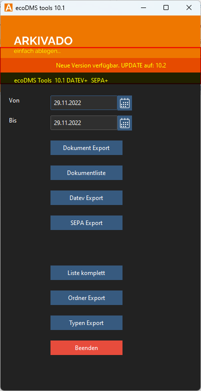

# Update der Version

Das Tool prüft online nach Updates. Sollte ein Update verfügbar sein, wird ein Banner im Programm angezeigt.

!!! info "Webrequest"
    Das Tool sucht via HTTPS auf lizenz.arkviado.digital Port 443 nach einer neuen Version.

- Nach einem Klick auf den Button „UPDATE“
- wird die neue Version heruntergeladen und die alte Version durch die neue ersetzt.

- Bitte stellen Sie sicher, dass der Kunde Schreibrechte für das Verzeichnis hat.
- Nach dem Aktualisieren wird das Programm geschlossen.
- Starten Sie es danach einfach neu.

!!! tip "IT-Profi-Info"
    Der Updater erstellt im Programmverzeichnis die neue Exe-Datei mit der Endung .new.
    Anschließend wird die alte Exe-Datei gelöscht und durch die neue Datei ersetzt.
    Weitere Änderungen am System erfolgen nicht! ;)
