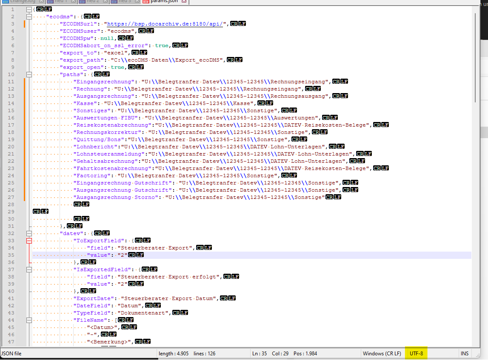
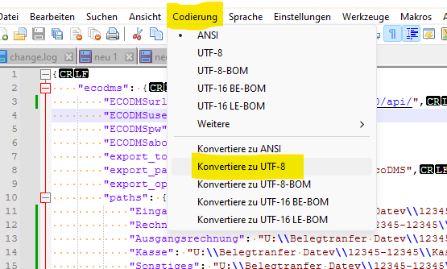

# UTF-8

UTF-8 ist das Format, in dem der Text in der Datei abgelegt wird. 
Ein falsches Encoding führt zu diversen Fehlern.
In allen modernen Systemen ist UTF-8 der Standard. 
Leider ist dies bei älteren Windows-Systemen noch nicht der Fall. 

Mehr zu UTF-8 in Wikipedia: [hier](https://de.wikipedia.org/wiki/UTF-8)

## Erkennen des Formats (Encoding)
Um eine Datei in UTF-8 zu bearbeiten, können Sie beispielsweise [Notepad++](https://notepad-plus-plus.org/downloads/) verwenden.

Die korrekte Einstellung für UTF-8 erkennen Sie so:

## Format ändern 
In Notepad++ können Sie das Encoding einer Datei ändern:

- Klicken Sie auf `Codierung >> Konvertiere zu UTF-8`
- Speichern Sie die Datei

