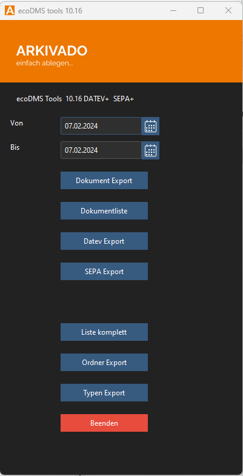
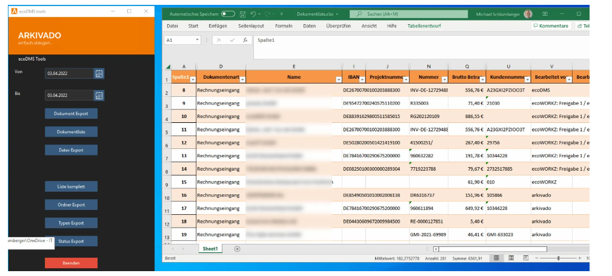

#  Übersicht

Version: 10.16 (Stand 07.02.2024)

## Funktionen

- Export von CSV- oder Excel-Listen der Klassifizierungsattribute in ecoDMS
- Export der ecoDMS-Ordnerstruktur
- Export der ecoDMS-Dokumentenarten
- Export von Dokumenten
- Export von Dokumenten mit oder ohne Metadaten für Datev Unternehmen Online. Der Export wird in ecoDMS am Dokument vermerkt.
- SEPA-Export: Erstellen von Buchungssätzen als SEPA-Datei

Es handelt sich um eine ausführbare Datei, die ohne Installation genutzt werden kann. Sie müssen nur einmalig die Daten zum ecoDMS-Server und Ihre Ablageverzeichnisse konfigurieren.

## Kontakt

Bezüglich Fragen kontaktieren Sie uns:

- [Kontakt](https://www.schlumberger.digital/#Kontaktformular_Startseite)
- EMail: support@schlumberger.digital 

-----------------
schlumberger digital e.K.  
Bauerngasse 30  
90443 Nürnberg  
Telefon 0911-21787-0  
office@schlumberger.digital  
  
Umsatzsteuer-ID-Nr.: DE186952363  
  
Sitz Nürnberg    Amtsgericht Nürnberg    HRA 19745
