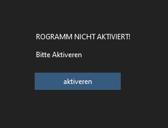
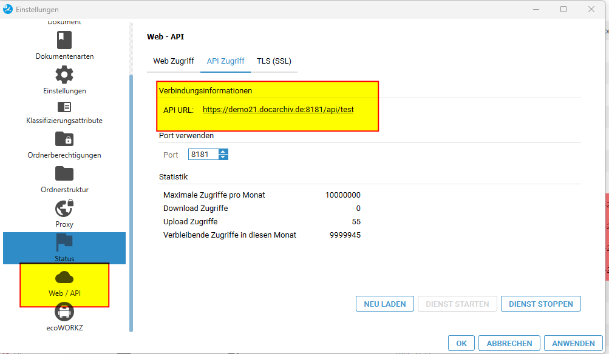
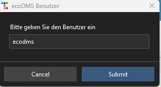
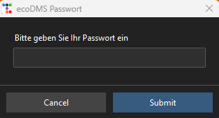
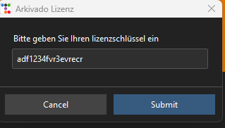

# Erster Programmstart

Beim erstmaligen Start werden Sie gebeten, die Software zu aktivieren. 
Klicken Sie auf **Aktivieren**, um die Software zu konfigurieren und freizuschalten.

- Zuerst fragt Sie das Tool nach dem API-Zugang von ecoDMS.    
       
  Dabei muss der vollständige Pfad zur API angegeben werden, 
  also einschließlich `https://` und `api/` am Ende. 
  Die entsprechende Einstellung können Sie in ecoDMS unter    
  **Einstellungen > Web / API > API Zugriff**    
  nachsehen.    
   
  Lassen Sie das `test` am Ende weg. In diesem Beispiel lautet die Adresse: `https://demo21.docarchiv.de:8181/api/!!!CODE!!!`

- Geben Sie anschließend den ecoMDS-Benutzernamen ein. Achten Sie hierbei auf die Groß- und Kleinschreibung.   

- Geben Sie das ecoDMS-Passwort ein.    
   

- Geben Sie den für das ecoDMS-Tool erhaltenen Lizenzschlüssel ein.   
  *Nicht der EcoDMS-Lizenzschlüssel.*   
     
