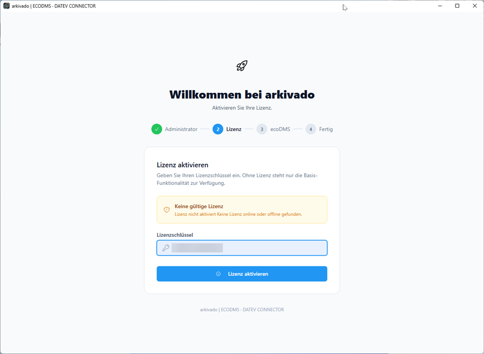
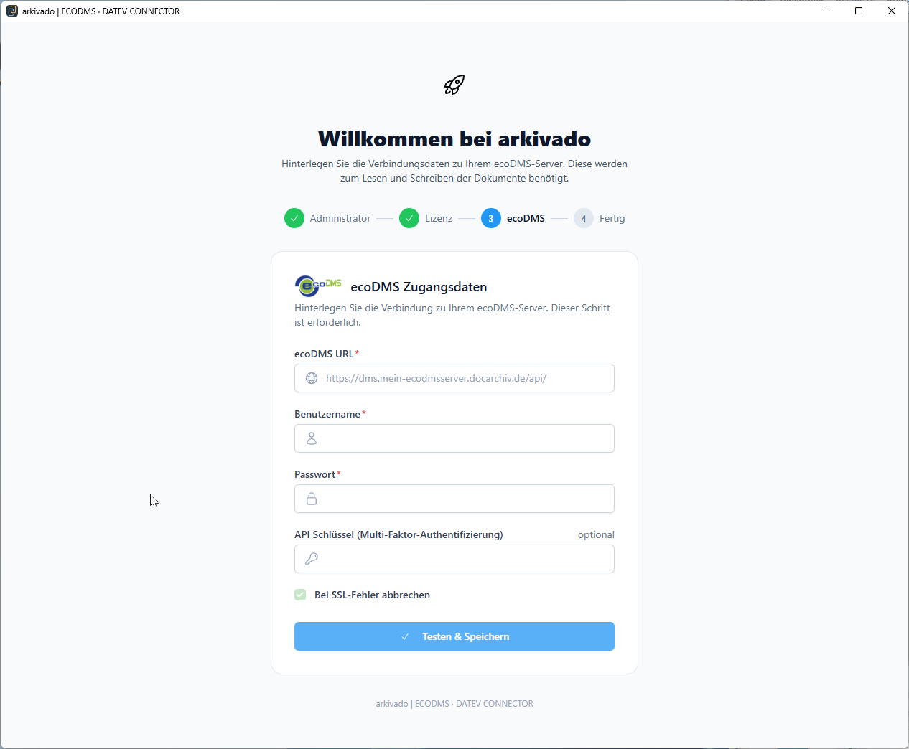
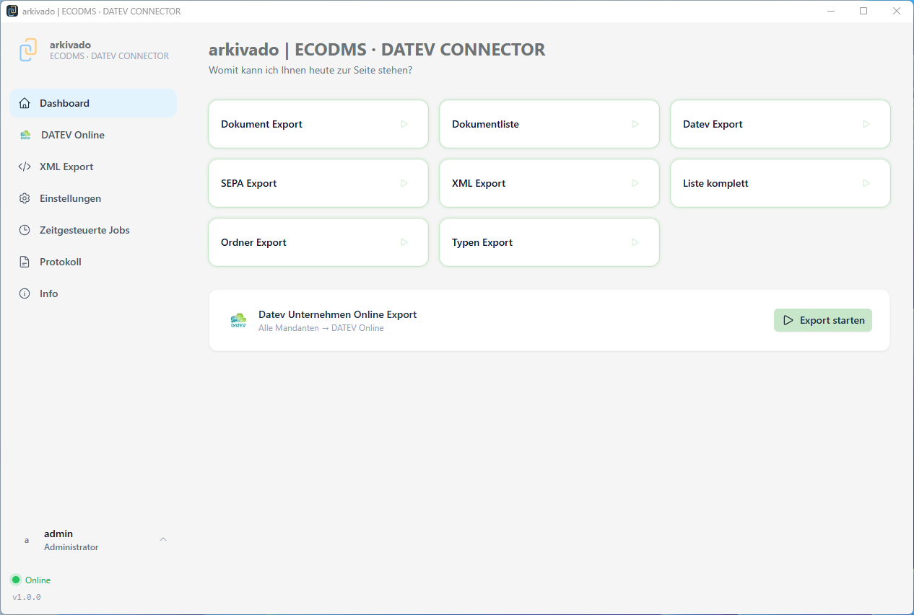

# Erster Start

Beim ersten Start werden Grundeinstellungen für Benutzer und der Verbindung zu Ihren ecoDMS Server eingerichtet.

!!! note ""
    Bitte konfigurieren nach Möglichkeit die Api von ecoDMS vor dem ersten Aufruf der Software.

    -> [Konfiguration des ecoDMS API Zugriffs](003 Konfiguration ecoDMS.md)

1. Anlage Benutzer und Passwort   

       

2. Aktivierung der Lizenz aus der zugesandten E-Mail   
    
    

3. Zugang zu Ihrem ecoDMS Server   
    - Voraussetzung: API in ecoDMS aktiviert   
Sollten Sie ecoDMS noch nicht konfiguriert haben, können Sie an dieser Stelle die Einrichtung durch Schliessen des Programms und Neustart der Anwendung fortsetzen und den ecoDMS Zugang später einrichten.

    - Einstellungen siehe ecoDMS Administration ([Konfiguration ecoDMS API Zugriff](003 Konfiguration ecoDMS.md))

4. Jetzt können Sie den Zugang zum ecoDMS Server konfigurieren

    

5. Nun ist Ihre Schnittstelle bereit und Sie können den DATEV Unternehmen Online Zugang einrichten.
([Konfiguration DATEV Zugang](004 Konfiguration DATEV DUO.md))

    
