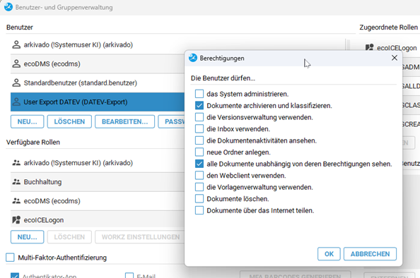
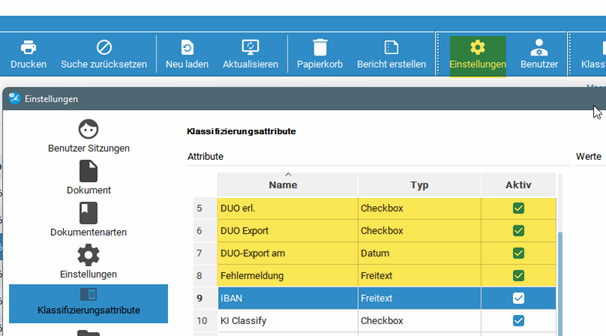

# Vorbereitung ecoDMS

#### Kurzfassung
- API Schnittstelle einrichten   
In ecoDMS ist die API Schnittstelle einzurichten und zu testen.
- Klassifizierungsfelder anlegen   
Für die Steuerung der Übertragung legen Sie die Klassifizierungen fest, welche Daten übertragen werden sollen und welche Daten zurückgeschrieben werden.
- Berechtigungen für den Zugriff prüfen

!!! note "Bitte beachten Sie"
    Für den Einsatz der Software und den Export von Belegen benötigen Sie eine **ecoDMS ONE Lizenz**. Business und Privatlizenzen unterstützen keinen API Zugriff auf die Dokumente. Falls Sie ein Upgrade benötigen können Sie dies bei uns erwerben.

1. **API Dienst in ecoDMS in den Einstellungen konfigurieren und starten**   

    

    Wenn Sie einen unserer Cloudserver benutzen, bitte an den Porteinstellungen und Pfaden keine Änderung vornehmen.
Betreiben Sie einen lokalen ecoDMS Server kontaktieren Sie bitte Ihren ecoDMS Partner.

2. **Im Bereich Zertifikate bitte die folgenden Einstellungen vornehmen**   

    

3. **Zugriffstest ist die ecoDMS API bereit bzw. der Zugriff möglich?**   
Der Test sollte folgendes in Ihrem Browser anzeigen:

    

    Zertifikatsfehler können Sie bei dem Test ignorieren, wenn Sie nur intern zugreifen.
Bei unseren Cloudinstallation wird das Zertifikat extern gesteuert.

4. **Berechtigungen prüfen**   

    Der Benutzer, der den Export vornehmen soll, muss auf die zu übertragenden Dokumente Zugriff haben. Damit können Sie in ecoDMS nachvollziehen, wer die Dokumente exportiert hat.

    

    Wenn Sie einen zentralen Benutzer nutzen, vermeiden Sie nach Möglichkeit die Nutzung des administrativen "ecodms" Benutzers. Legen Sie einen Neuen Benutzer mit entsprechenden Rechten an, so können Sie die Aktionen nachverfolgen.

5. **Einrichtung der Klassifizierungsfelder**   
    Diese sind notwendig um der Schnittstelle zur DATEV (in Klammer unsere vorgeschlagenen Feldnamen) mitzuteilen:
    - was soll exportiert werden ("DUO Export")
    - wurde exportiert ("DUO erl.")
    - wann wurde exportiert ("DUO-Export am")
    - Fehlermeldung, falls was nicht geklappt hat ("Fehlermeldung")

    !!! note "Anmerkung"   
    Wenn Sie Feldnamen ändern bzw. neu erstellen, müssen Sie die ecoDMS API unter Einstellungen in ecoDMS stoppen und starten.
Im arkivado Connector werden die neuen bzw. veränderten Klassifizierungen nach einem Neustart der App die neuen oder geänderten Felder wieder eingelesen.   

    

**Nun ist Ihre Schnittstelle bereit und Sie können im nächsten Schritt den DATEV Unternehmen Online Zugang einrichten.**   