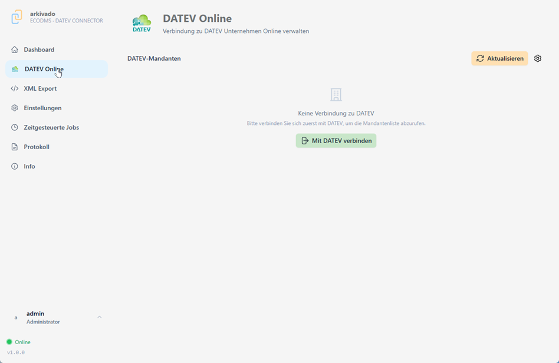
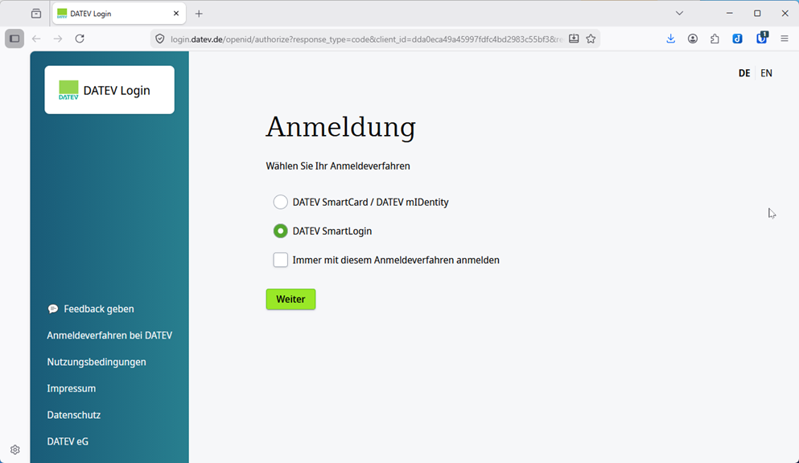
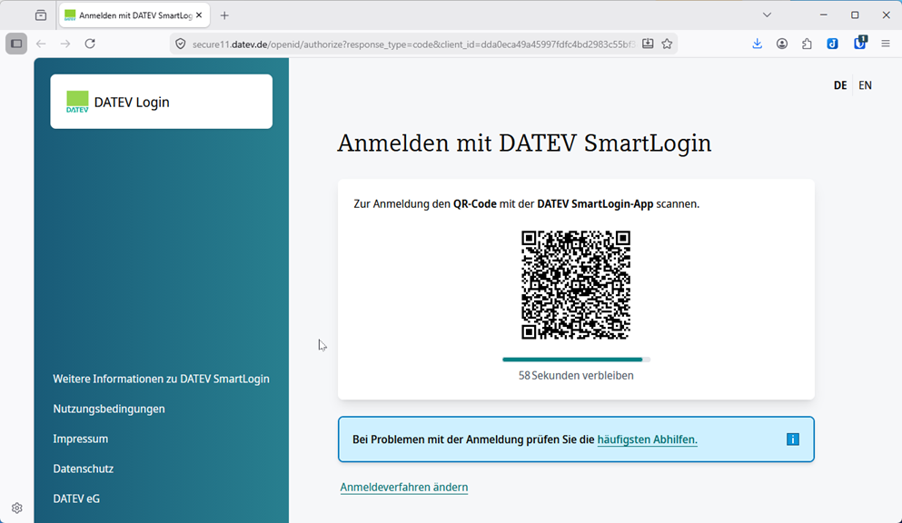
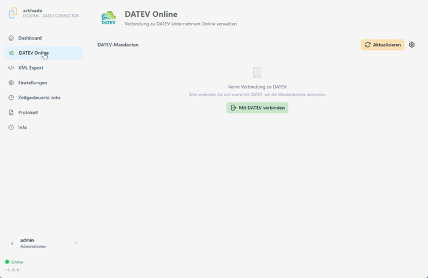
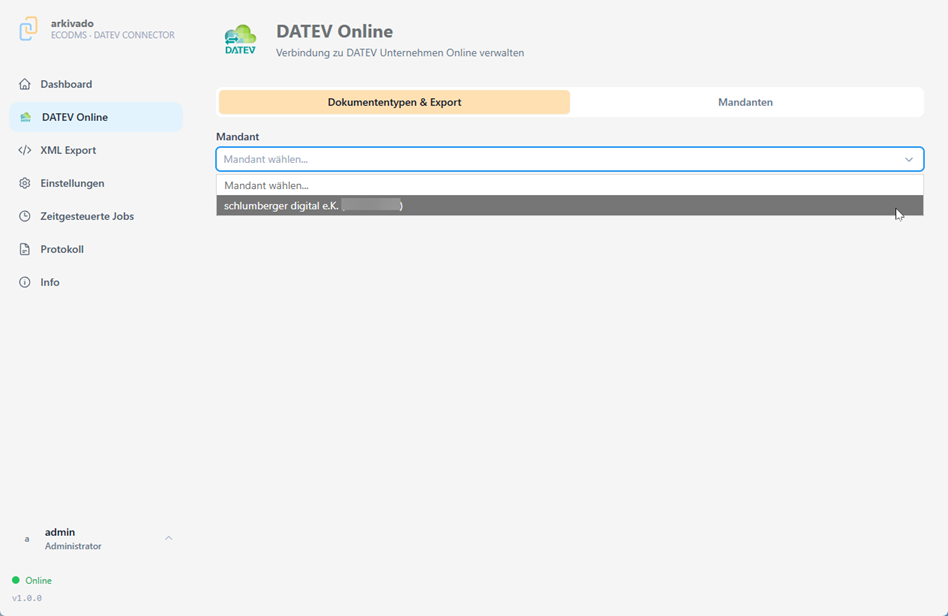

# DATEV Unternehmen Online (DUO) anbinden

Im folgenden erläutern wir die Anbindung an DATEV Unternehmen Online.
Dazu benötigen Sie einen Onlinezugang zu Unternehmen Online mittels Smart APP oder USB Stick.
Die benötigten Zugangsdaten erhalten Sie von Ihrem Steuerberater.
Bitte testen Sie den Zugang vor der Einrichtung.

Unsere Software benötigt die Anmeldung nur einmalig und ist bis zu einem Jahr gültig.
Das Anmeldeverfahren benötigen Sie nur für den Webzugriff um in Unternehmen Online zu arbeiten.   

1. Konfiguration des DATEV Zugangs   
Mit "DATEV verbinden" öffnet die Anmeldemaske von DATEV Unternehmen Online   

    

2. Anmeldung auf der DATEV Website   

    

3. Bei Anmeldung mit USB Stick (Smartcard) benötigen Sie Ihre PIN   
Mit Ihrem Smartphone können Sie die DATEV App und SmartLogin nutzen

    

4. Nach der Anmeldung können Sie das Browserfenster wieder schliessen und zur Anwendung zurückkehren.
Hier können Sie jetzt einen Mandanten wählen.   

    

5. Anschließend gehen Sie auf "Aktualisieren" und wählen den gewünschten Mandanten.
Falls Sie mehrere Mandanten haben, können diese nun ausgewählt werden und individuell konfiguriert werden.   

    
