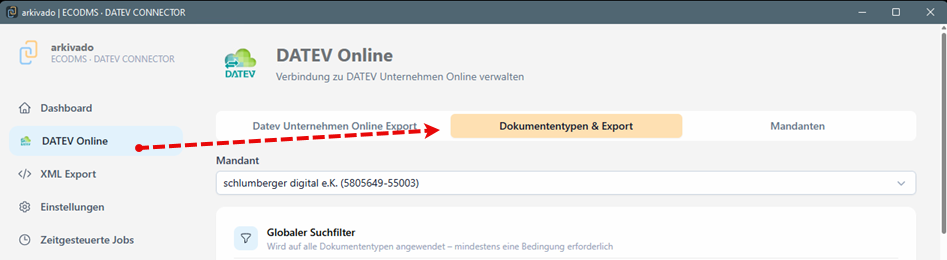
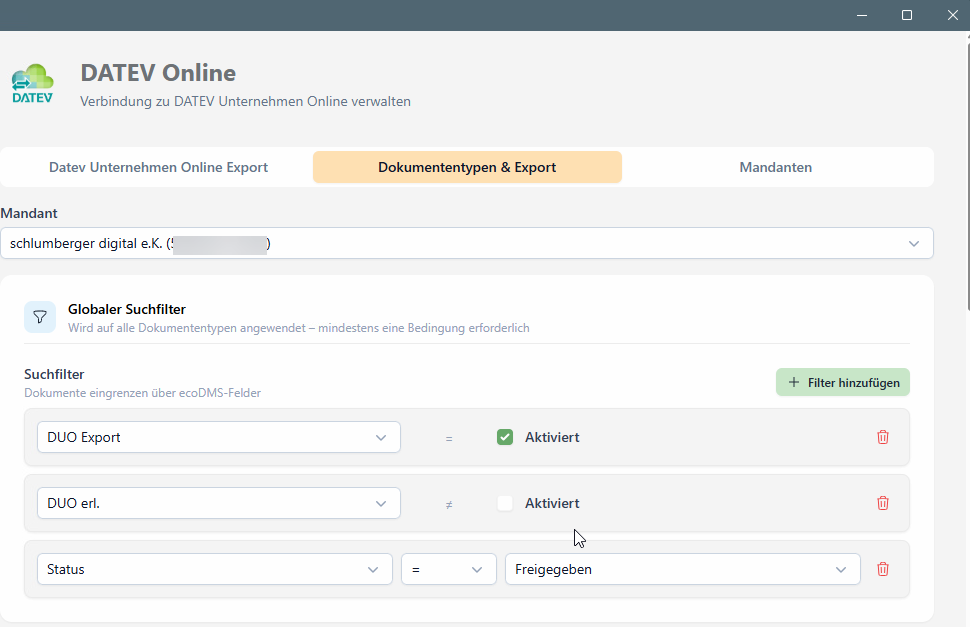
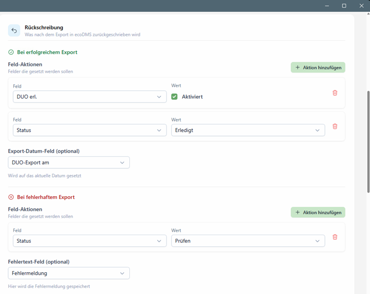
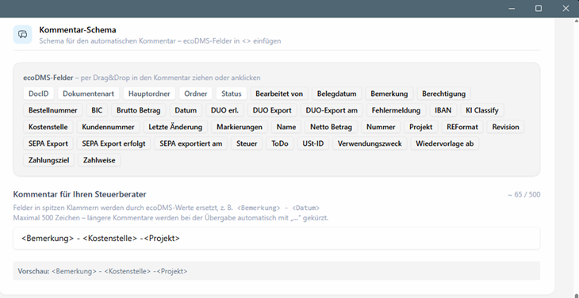
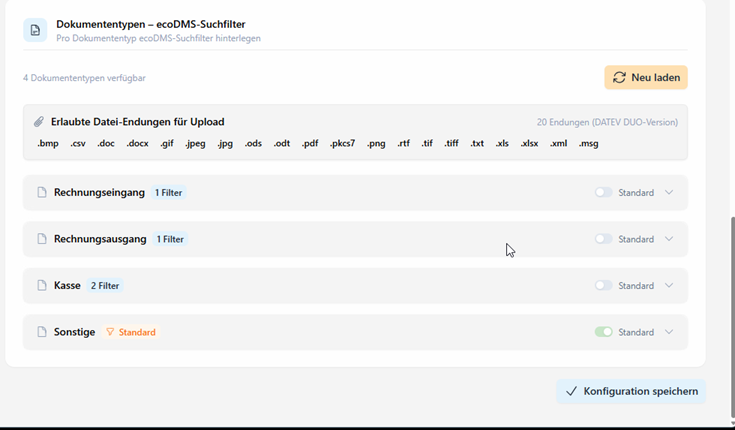
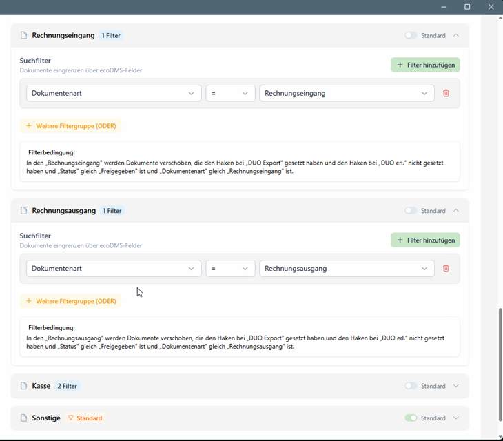

# CONNECTOR - Anpassungen DATEV Übergabe DATEV Unternehmen Online (DUO) anbinden

Für die Verbindung mit Unternehmen Online und der Zuweisung der Klassifizierungen sind die folgenden Schritte vorzunehmen.

**Wechseln Sie im arkivado CONNECTOR zu DATEV Online**   
Hier nehmen Sie unter Dokumenttypen & Export die folgenden Einstellungen vor:   

- Welche Belege/Dokumentarten/Ordner sollen exportiert werden ("Suchfilter")
- Was wird in ecoDMS zurückgeschrieben ("Rückschreibung")
- Fehlerbehandlung ("Bei fehlehaftem Export")
- Soll eine Notiz an DATEV übergeben werden ("Kommentar-Schema")
- Zuordnung von Dokumenten (ecoDMS) zu Belegtypen (DATEV) ("Dkumententypen-ecoDMS-Suchfilter")

**Das Vorgehen im Detail:**

1. **Suchfilter konfigurieren**   
    Was soll exportiert bzw. übergeben werden?
    Bestimmen Sie die Kriterien nach welchen in ecoDMS die Daten z.B. markiert wurden. Hier im Beisiel soll das Feld "DUO Export" einen Haken haben und bei "DUO erl. " kein Haken sein. d.h. die Dokumente sind noch nicht exportiert worden. Der Status soll "Freigegeben" sein.

    

2. **Rückschreibung - Welche Klassifizierung soll an ecoDMS übergeben werden**   
Hier können Sie angeben, was nach ecoDMS zurückgeschrieben wird.
Im Beispiel unten: In das Feld "Duo erl." soll ein Haken und der "Status" auf "Erledigt" gesetzt werden.
Zusätzlich wir das Exportdatum nach "DUO-Export am" geschrieben.

    

3. **Konfiguration eines Kommentars für das Notizfeld in Unternehmen Online**   
Per Drag & Drop können Sie Felder in das Kommentarfeld ziehen.
Die zur Verfüg stehenden Felder stammen aus der ecoDMS Anwendung.
Es sind maximal 500 Zeichen möglich, d.h. evtl. wird der Kommentar abgeschnitten, falls er länger ist.   

    

4. **Als letzten Punkt konfigurieren Sie die Zuordnung der DATEV Belegtypen.**

    

    - Im Beispiel werden z.B. alle Dokumentart "Rechnungsausgang" dem Belegtyp "Rechnungsausgang" in DATEV zugeordnet.
    - Bei "Sonstigen" ist Standard hinterlegt. Dort landen alle Dokumente, die nicht definiert sind.
    Das können z.B. Dokumente sein, die an den Steuerberater übertragen werden sollen, jedoch nicht eindeutig klassifziert sind.
    - **Die aufgeführten Belegtypen/Ordner hat Ihr Steuerberater so in DATEV Unternehmen Online hinterlegt.**
    - Die Typen werden automatisch aus DATEV Unternehmen Online übernommen und können hier nicht geändert werden.
    - **Denken Sie daran Ihre Einstellungen zu speichern.**

    

