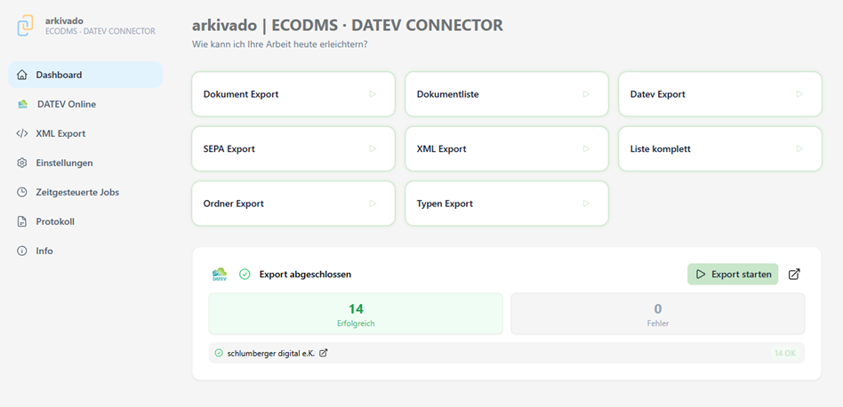
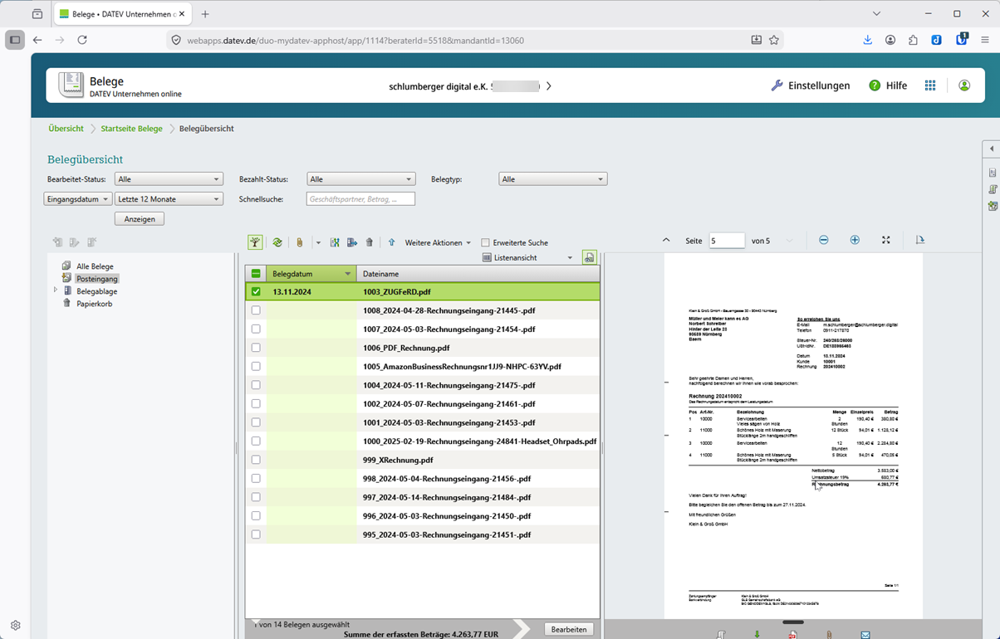
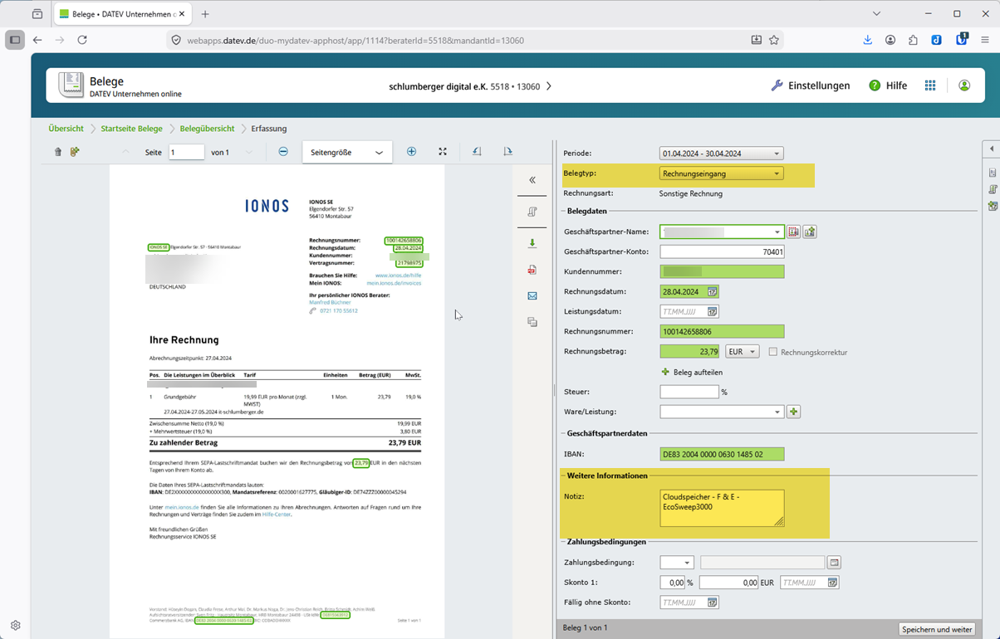
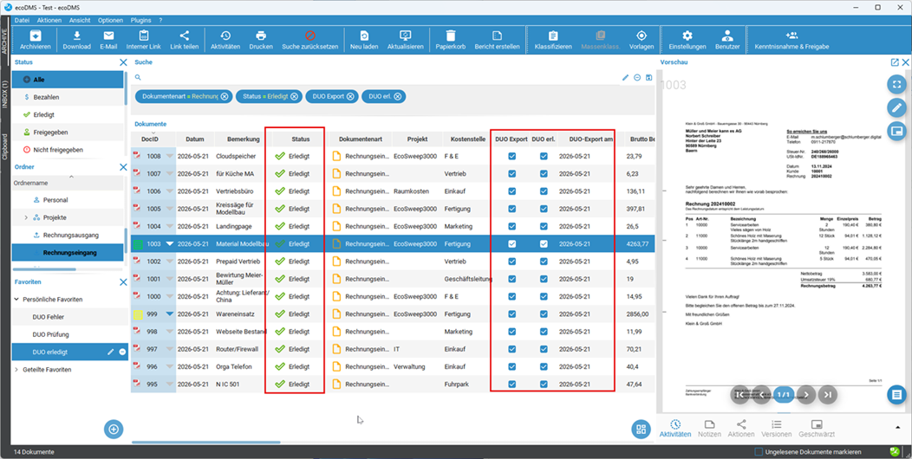

# 

# Übertragungung von ecoDMS nach DATEV

1. **Bearbeitung der Belege in ecoDMS**   
    Im Beispiel hier wurden die Rechnung mit unserer invoice KI eingeleden, geprüft und auf Status "Freigegeben" gesetzt. Der Haken für den Übertrag nach DATEV ("DUO Export") ist gesetzt und könnte auch für weitere Dokumente manuell oder automatisch gesetzt werden.

       

2. **Start der Übertragung im arkivado CONNECTOR**   
    Dies kann manuell angestossen werden, möglich ist auch die Ausführung zeitgesteuert oder als Dienst.
    
    

3. **Nun ist die Übertragung abgeschlossen.**   
    Bei Fehlern können Sie auf der linken Seite das Protokoll aufrufen.

    

4. **Ergebnis der Übertragung in DATEV Unternehmen Online (DUO)**   
    Anschliessend finden Sie alle Dokumente in Ihrer gewohnten DATEV Oberfläche.
    Welche Daten Sie in der Belegerfassung sehen können, hängt von den Einstellungen Ihres Steuerberaters bzw. Ihren Einstellungen ab.

    

    

5. **Abschluss der Übertragung - Ergebnis in ecoDMS**   
    Die Übertragung in ecoDMS vermerkt und der Status auf "Erledigt" gesetzt.
    Diese Belege werden bei der nächsten Übertragung nicht mehr berücksichtigt.

    
