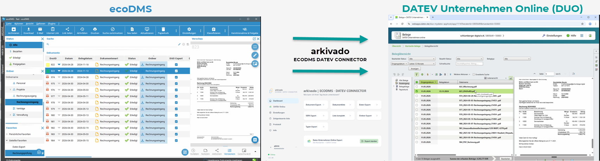
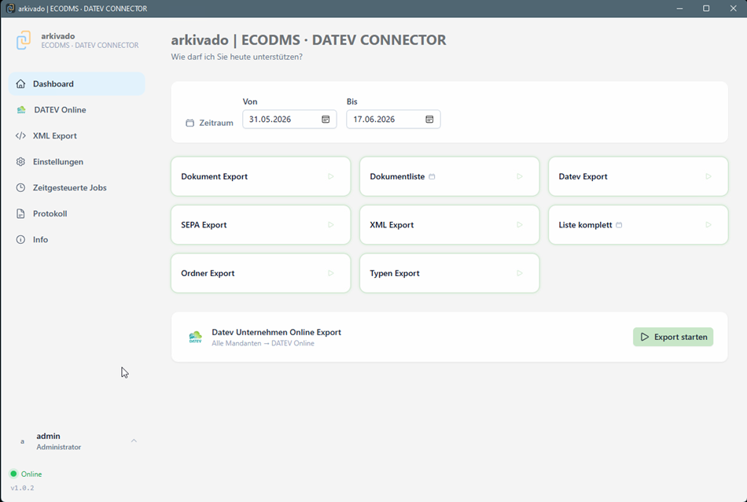

# { width="25" } arkivado ECODMS • DATEV CONNECTOR   

**DATEV zertifiziert zur Übergabe von Belegen an DATEV Unternehmen Online (DUO)**

####Direkte Belegübergabe nach DATEV Unternehmen Online

Der Nachfolger unseres arkivado tools - jetzt mit komplett überarbeiteter Oberfläche und Konfigurationsmöglichkeit.

Enthält alles aus unserem arkivado Tool und wird fortlaufend weitere Funktionen erhalten.   
Der arkivado CONNECTOR ist unser neues Tool für die Anbindung verschiedenster Software, Cloudanbierter und KI Modelle.

Direkt Online ***ohne Belegtransfer*** und lästiges Anmelden übertragen.   
**Schnell - Einfach - Automatisch - übersichtlich und nachvollziehbar**

!!! note ""
    Der arkivado Connector verbindet sich mit ecoDMS mit der sogenannten API Schnittstelle.
    Deshalb ist es notwendig die API in den ecoDMS Einstellungen freizuschalten ([Konfiguration des ecoDMS API Zugriffs](003 Konfiguration ecoDMS.md)). Da Dokumente/Belege zu Datev Unternehmen Online (DUO) übertragen werden verbraucht ecoDMS API-Punkte. Diese sind nur in der ***ecoDMS ONE Lizenz*** enthalten. Mit der Business bzw. Privat Edition können keine Dokumente exportiert bzw. übertragen werden.

Dank des arkivado Connectors ist keine DATEV Belegtransfer Software oder senden per E-Mail für die DATEV Übertragung notwendig. Der Vorgang der Übertragung wird in ecoDMS mit Datum vermerkt.
So geht nichts verloren oder wird doppelt übertragen.
Dank der Markierung ist es auch nicht notwendig per Datum zu übertragen. Das System merkt sich ob Belege schon übertragen sind und setzt entsprechende Werte in ecoDMS.   

**Die Schnittstelle überträgt Belegbilder plus ein Notizfeld - es werden keine Klassifizierungen übertragen.**   
Belegbilder sind in DATEV-Sprech Belege bzw. die Dokumente (z.B. PDF, x-Rechnung oder ZUGFeRD Belege)

   

Die Übertragung kann unabhängig vom Datumsbereich fortlaufend durchgeführt werden.   
==Der Übertrag ist auch für mehrere Mandanten/Betriebe möglich==   

   

**Das Tool enthält auch die folgenden weiteren Funktionen:**

- DATEV Export/Übergabe inkl. Buchungsdaten
- SEPA Export Onlinebanking
- Frei konfigurierbare formatierte Excellisten
- Frei konfigurierbare CSV Exporte
- Export in weitere Buchhaltungsprogrammen (DATEV-Format, CSV, XML usw.)
- Zeitgesteuert oder als Dienst einsetzbar
- Weitere Exporte aus ecoDMS: Dokumente und Dokumentlisten
- Berechtigungsmatrix zu Benutzern, Rollen und Ordnerberechtigungen nach Excel
- Konfigurierbare Oberfläche   

Läuft unter Microsoft Windows lokal ohne Installation.   
Voraussetzung ist der API Zugriff mit der ecoDMS One Lizenz (API Punktepaket).   
Alle Pfade und Ablagen können individuell angepasst werden.   

Einstellungen in DATEV Unternehmen Online sind teilweise von Ihrem Steuerberater oder DATEV Partner zu konfigurieren.

