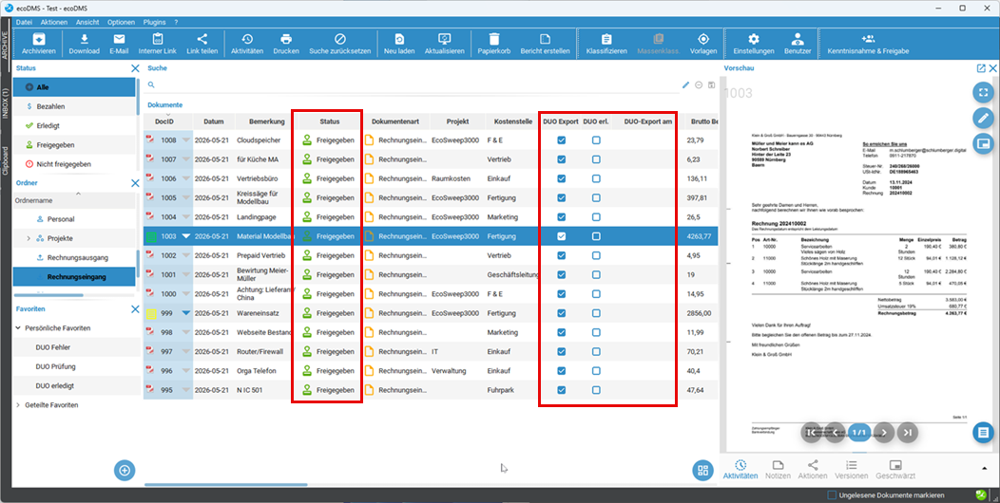
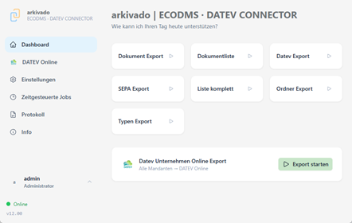

# 

# Übertragungung von ecoDMS nach DATEV

1. **Bearbeitung der Belege in ecoDMS**   
    Im Beispiel hier wurden die Rechnung mit unserer invoice KI eingeleden, geprüft und auf Status "Freigegeben" gesetzt. Der Haken für den Übertrag nach DATEV ("DUO Export") ist gesetzt und könnte auch für weitere Dokumente manuell oder automatisch gesetzt werden.

       

2. **Start der Übertragung in der APP.**   
    Dies kann manuell angestossen werden, oder auch zeitgesteuert oder als Dienst ausgeführt werden.
    
    

3. **Nun ist die Übertragung abgeschlossen.**   
    Bei Fehlern können Sie auf der linken Seite das Protokoll aufrufen.

    

4. **Abschluss der Übertragung**   
    Die Übertragung in ecoDMS vermerkt und der Status auf "Erledigt" gesetzt.
    Diese Belege werden bei der nächsten Übertragung nicht mehr berücksichtigt.

    
