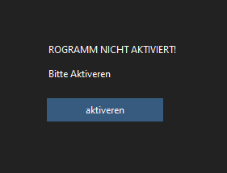
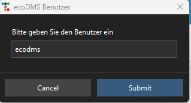
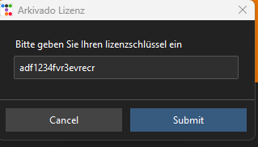

# Erster Programmstart

1. Beim erstmaligen Start wird die Software aktiviert.    
Starten Sie mit einem Klick auf **Aktivieren**.    
Nun startet die Konfiguration des Tools.    
Bitte halten Sie Ihre Lizenznummer bereit.    


2. Nun benötigen Sie den Zugang zu Ihrer ecoDMS Installation bzw. dem Pfad zum Server. Zuerst fragt Sie das Tool nach dem API-Zugangspfad von ecoDMS.    
<br>
<br>Geben Sie hier den vollständigen Pfad zur API an, 
also einschließlich `https://` und `api/` am Ende. 
Ihren Pfad finden Sie unter den administrativen Einstellungen von ecoDMS:
<br><br>Prüfen Sie die Einstellungen der API unter "Einstellungen > Web/API > API Zugriff" in der ecoDMS Administration.
<br><br>
<br>Bitte "test" nicht übernehmen. Die Portadresse "8181" kann in Ihrer Installation abweichen.
``` title="Beispielpfade:"
https://192.168.1.20:8181/api/    
https://cloudserver.docarchiv.de:8181/api/
https://<Ihr Serverpfad>:8181/api/
```

3. Geben Sie anschließend den ecoDMS-Benutzernamen ein. Achten Sie auf Groß- und Kleinschreibung analog zur Anmeldung in ecoDMS.
<br>Achtung: Der Benutzer/User benötigt die Rechte, die zu exportierenden Daten auch lesen und falls notwendig klassifizieren zu können.
Beachten Sie auch, dass wenn Sie dafür einen speziellen User anlegen, dieser mit dem Benutzernamen in den Aktivitäten vermerkt wird.
<br><br>

4. Geben Sie das ecoDMS-Passwort ein.
<br><br>

5. Geben Sie den Lizenzschlüssel des arkivado tools ein
*Nicht den EcoDMS-Lizenzschlüssel benutzen!*
<br><br>


!!!tip Ändern der Zugangsdaten
    - bestehende ecoDMS Zugangsdaten können auch grafisch geändert werden: sieh [hier](<../5. Wissenswertes/FAQ/EcoDMS Zugangangsdaten ändern.md>)
