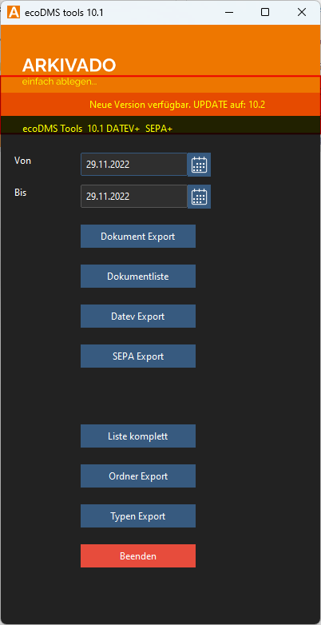

# Update der Version

Das Tool prüft online nach Updates. Sollte ein Update verfügbar sein, wird dies angezeigt.

!!! info "Webrequest"
    Das Tool sucht via HTTPS auf lizenz.arkviado.digital Port 443 nach einer neuen Version.

- Nach einem Klick auf den Button „UPDATE“ wird die neue Version heruntergeladen und die alte Version ersetzt.
- Stellen Sie sicher, dass Schreibrechte für das Verzeichnis des Tools gewährleistet sind.
- Nach der Aktualisierung wird das Programm geschlossen.
- Starten Sie das Programm nach der Aktualisierung erneut.