# Formatierung Excel/CSV

**Änderungen sind im Bereich "Dokumentliste Export" anzufügen.**

## Excel
``` JSON title="Konfiguration der Excel Exportdatei:"
 "excel":{
            "do_format": false,
            "table_style": "TableStyleMedium1",
            "date_style": "DD.MM.YYYY",
            "number_style": "#,##0.00"
        },
```
Für den Export in Excel Format kann die Tabelle automatisch formatiert werden.

\* = Optional

| Optional | Feld         | Beschreibung                                                                                      | Beispielwert            |
| -------- | ------------ | ------------------------------------------------------------------------------------------------- | ----------------------- |
| *        | do_format    | Wird es auf false gesetzt, wird die Formatierung deaktiviert. Standardmäßig ist die Formatierung an | ```false``              |
| *        | table_style  | Wie die Tabelle formatiert werden soll. Standard ist: ```TableStyleMedium6```                     | ```TableStyleLight10``` |
| *        | date_style   | Gibt an, wie ein Datum formatiert werden soll. Standard ist: Tag Monat Jahr                       | ```DD.MM.YYYY```        |
| *        | number_style | Gibt an, wie eine Zahl  formatiert werden soll. Standard ist: 10,22                               | ```#,##0.00```          |


### Excel Tabellen Formatierung
| Option             | Vorschau                                          |
| ------------------ | ------------------------------------------------- |
| TableStyleLight1   | 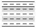     |
| TableStyleLight2   |      |
| TableStyleLight3   |      |
| TableStyleLight4   |      |
| TableStyleLight5   |      |
| TableStyleLight6   |      |
| TableStyleLight7   |      |
| TableStyleLight8   |      |
| TableStyleLight9   |      |
| TableStyleLight10  |    |
| TableStyleLight11  |    |
| TableStyleLight12  |    |
| TableStyleLight13  |    |
| TableStyleLight14  |    |
| TableStyleLight15  | 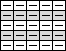   |
| TableStyleLight16  | 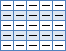   |
| TableStyleLight17  | 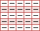   |
| TableStyleLight18  | 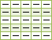   |
| TableStyleLight19  |    |
| TableStyleLight20  | 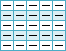   |
| TableStyleLight21  | 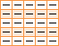   |
| TableStyleMedium1  |    |
| TableStyleMedium2  |    |
| TableStyleMedium3  |    |
| TableStyleMedium4  |    |
| TableStyleMedium5  |    |
| TableStyleMedium6  |    |
| TableStyleMedium7  |    |
| TableStyleMedium8  | 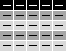   |
| TableStyleMedium9  | 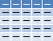   |
| TableStyleMedium10 | 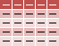 |
| TableStyleMedium11 | 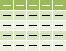 |
| TableStyleMedium12 | 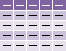 |
| TableStyleMedium13 | 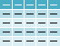 |
| TableStyleMedium14 | 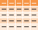 |
| TableStyleMedium15 |  |
| TableStyleMedium16 |  |
| TableStyleMedium17 |  |
| TableStyleMedium18 |  |
| TableStyleMedium19 |  |
| TableStyleMedium20 |  |
| TableStyleMedium21 |  |
| TableStyleMedium22 | 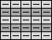 |
| TableStyleMedium23 | 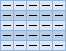 |
| TableStyleMedium24 | 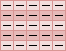 |
| TableStyleMedium25 | 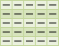 |
| TableStyleMedium26 |  |
| TableStyleMedium27 |  |
| TableStyleMedium28 | 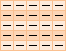 |
| TableStyleDark1    |        |
| TableStyleDark2    |        |
| TableStyleDark3    |        |
| TableStyleDark4    |        |
| TableStyleDark5    |        |
| TableStyleDark6    |        |
| TableStyleDark7    |        |
| TableStyleDark8    |        |
| TableStyleDark9    |        |
| TableStyleDark10   |      |
| TableStyleDark11   |      |

## CSV
``` JSON title="Konfiguration der csv Exportdatei:"
 "csv":{
            "newline": "\r\n",
            "encoding": "iso-8859-1",
            "seperator": ";",
            "quotechar": "\"",
            "quote":"minimal",
            "number_round":2,
            "number_format":","

        },
```

Wird ein CSV Export ausgeführt, kann hier das Aussehen der CSV bestimmt werden. 

\* = Optional

| Optional | Feld          | Beschreibung                                                                                                                                                                                                               | Beispielwert     |
| -------- | ------------- | -------------------------------------------------------------------------------------------------------------------------------------------------------------------------------------------------------------------------- | ---------------- |
| *        | newline       | Welches Zeichen am Ende stehen soll. Windows erwartet ```\r\n``` linux und Mac brauchen nur ```\n```   Standard ist:    ```\r\n```                                                                                         | ```\n```         |
| *        | encoding      | In welchem Zeichensatz die Daten gespeichert werden. Standard ist ```UTF-8``` und ist allgemein empfohlen.  Datev erwartet das alte Windows Format:  ```iso-8859-1```                                                         | ```iso-8859-1``` |
| *        | seperator     | Mit welchem Zeichen werden die Spalten getrennt? Standard ist ```,```                                                                                                                                                      | ```;```          |
| *        | quotechar     | Wie werden Spalten umschlossen, die Sonderzeichen wie z.B. einen Separator enthalten?  Standard ist ein doppeltes Anführungszeichen ```"```  Achtung in JSON Format müssen Sie das Zeichen mit einem ```\``` davor schreiben | ```\"```         |
| *        | quote         | Was soll alles umschlossen werden? die Liste der Werte weiter unten.                                                                                                                                                       |                  |
| *        | number_round  | Auf wieviele Stellen nach dem Komma soll gerundet werden? (Es wird buchhalterisch gerundet)                                                                                                                                | ```2```          |
| *        | number_format | Wie wird das Dezimaltrennzeichen dargestellt. Im Standard : ```.``` für Deutschland typisch: ```,```                                                                                                                       | ```,```          |


### CSV Quote Style


- ```minimal``` : Standardmodus: Felder werden nur dann in Anführungszeichen gesetzt (gequotet), wenn es unbedingt nötig ist - also wenn sie Kommas, Anführungszeichen oder Zeilenumbrüche enthalten. Dieser Modus versucht, die Verwendung von Anführungszeichen auf das notwendige Minimum zu beschränken.
- ```alles```: Alle Felder werden in Anführungszeichen gesetzt, unabhängig davon, ob sie spezielle Zeichen enthalten oder nicht. Dies kann hilfreich sein, um sicherzustellen, dass die Struktur der CSV-Daten eindeutig ist, reduziert jedoch eventuell die Lesbarkeit der Datei.
- ```zeichen```: Hier werden alle nicht-numerischen Felder in Anführungszeichen gesetzt. Numerische Felder werden ohne Anführungszeichen geschrieben. Dieser Modus kann nützlich sein, wenn Sie sicherstellen möchten, dass numerische Werte leicht als solche erkannt und verarbeitet werden können, während Textfelder klar als Text markiert sind.
- ```none```: In diesem Modus werden keine Felder in Anführungszeichen gesetzt. Dies bedeutet, dass Sie selbst sicherstellen müssen, dass Ihre Daten keine Kommas oder andere spezielle Zeichen enthalten, die normalerweise das Einfügen von Anführungszeichen erfordern würden. Dies kann zu Problemen führen, wenn solche Zeichen unbeabsichtigt in den Daten vorkommen, da die CSV-Struktur dadurch gebrochen werden kann.

