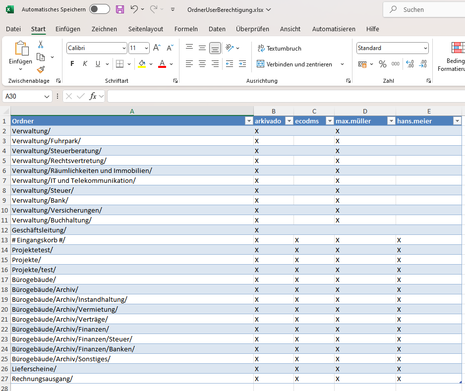
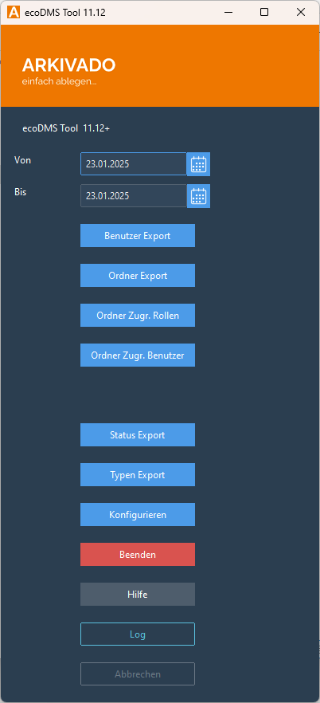

# Verwaltungsübersicht

Für Administratoren und die Verwaltung ist es wichtig, den Überblick über ecoDMS zu behalten.

Typische Fragen sind hier:

- Wer hat Zugriff auf einen Ordner in ecoDMS?
- Welche Gruppe ist einem Ordner zugeordnet?
- Welche Benutzer sind in ecoDMS angelegt?
- Welche Ordner, Status und Dokumenttypen sind in ecoDMS angelegt?

Mit dem Tool können diese Listen mit einem Klick oder zeitgesteuert exportiert werden.





## Funktionen

- **Benutzer Export**: Erstellt eine Excel-Tabelle mit Rollen und Benutzern. So erhält man einen Überblick, welche Benutzer es gibt und in welchen Rollen sie sind.
- **Ordner Export**: Erstellt eine Excel-Tabelle mit allen Ordnern, die in ecoDMS angelegt sind.
- **Ordner Zugr. Rollen**: Erstellt eine Excel-Tabelle, in der aufgeführt wird, welche Benutzerrolle auf welchen Ordner Zugriff hat.
- **Ordner Zugr. Benutzer**: Wie bei den Rollen, nur werden die Rollen auf die einzelnen Nutzer heruntergebrochen. Man sieht hier also, welcher Benutzer auf welchen Ordner Zugriff hat.
- **Status Export**: Erstellt eine Excel-Tabelle mit allen Statusarten, die in ecoDMS angelegt sind.
- **Typen Export**: Erstellt eine Excel-Tabelle mit allen Dokumenttypen, die in ecoDMS angelegt sind.

[DOWNLOAD](static/adminkonfig/Admin%20Konfig%20Export.zip){ .md-button :download="Admin Konfig Export.zip" }

## Konfigurieren / Erste Verwendung

1. Laden Sie die ZIP-Datei [Admin Konfig Export](static/adminkonfig/Admin%20Konfig%20Export.zip){:download="Admin Konfig Export.zip"} herunter.
2. Exportieren Sie die beiden Dateien `adminkonfig.json` und `Admin Konfig Export.bat` in das Verzeichnis, in dem das Arkivado-Tool liegt (falls Sie es noch nicht heruntergeladen haben, dann [hier](https://lizenz.arkivado.digital/lizer/download/Arkivado_Ecodms_Tools)).
3. Starten Sie die `Admin Konfig Export.bat`.
4. Es erscheint eine Meldung, dass keine Lizenz hinterlegt ist.
5. Geben Sie Ihren Lizenzschlüssel ein.
6. Die Lizenz wird aktiviert und in Ihre `adminkonfig.json` geschrieben. Das Programm wird beendet.
7. Starten Sie die `Admin Konfig Export.bat` erneut.
8. Klicken Sie auf **Konfigurieren**.
9. Geben Sie den API-Pfad zu ecoDMS ein (siehe [hier](../1.%20Einleitung/001voraussetzungen.md) für weitere Informationen).
10. Geben Sie einen Admin-Benutzer und dessen Passwort ein.
11. Klicken Sie auf **Speichern**.
12. Nun können Sie die Berichte erstellen.


## Kopiervorlage

Zur Dokumentation der Konfigs hier noch einmal die beiden Dokumenete aus der ZIP zum kopieren. 

``` json  title="adminkonfig.json"
 {
  "ecodms": {
    "ECODMSurl": "https://hiermeineAPIAdresse/api/",
    "ECODMSuser": "ecodms",
    "ECODMSpw": null,
    "ECODMSabort_on_ssl_error": true,
    "export_to": "excel",
    "export_path": "C:\\ecoDMS Daten\\Export_ecoDMS",
    "export_open": true,
    "paths": {
      "Sonstiges": "C:\\Daten\\Daten\\ecoDMS Export\\Sonstiges"
    },
    "excel": {
      "do_format": true,
      "table_style": "TableStyleMedium2"
    },
    "ECODMStoken": ""
  },
  "gui": {
    "theme": "blau",
    "buttons": [
      {
        "funktion": "Benutzer Export",
        "text": "Benutzer Export",
        "show": true
      },
      {
        "funktion": "Ordner Export",
        "text": "Ordner Export",
        "show": true
      },
      {
        "funktion": "Ordner Rollen Export",
        "text": "Ordner Zugr. Rollen",
        "show": true
      },
      {
        "funktion": "Ordner Benutzer Export",
        "text": "Ordner Zugr. Benutzer",
        "show": true
      },
      {
        "funktion": "Status Export",
        "text": "Status Export",
        "show": true
      },
      {
        "funktion": "Typen Export",
        "text": "Typen Export",
        "show": true
      },
      {
        "funktion": "Konfigurieren",
        "text": "Konfigurieren",
        "show": true
      }
    ]
  },
  "license": ""
}
```


``` bat  title="Admin Konfig Export.bat"
@echo off
pushd %~dp0
start "" /min "%~dp0arkivado.exe" -c "%~dp0adminkonfig.json"
exit
```