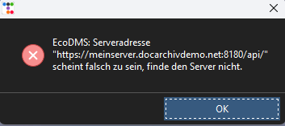

# Verbindungsfehler: falscher URL


## Problembeschreibung

- Das Tool startet 
- Beim Klick auf irgendeine Taste kommt eine Fehlermeldung

``` title="Verbindungsfehler im Log"
2024-05-14 10:08:04,830 - CRITICAL - EcoDMS: Serveradresse "https://meinserver.docarchivdemo.net:8180/api/" scheint falsch zu sein, finde den Server nicht. 
2024-05-14 10:08:32,215 - CRITICAL -  Ein Fehler bim Verbinden mit ecoDMS ist aufgetreten. Prüfen Sie das Log.
``` 



## Erklärung

Das arkivado Tool versucht sich mit ecoDMS zu verbinden und stellt dabei fest, dass der Server nicht gefunden wird.


Dies passiert immer dann, wenn der ```ECODMSurl``` falsch ist. 


## Lösung 

Die richtige Adresse muss in die Konfiguration.
Dazu haben Sie drei Möglichkeiten: 

- Konfig ändern drückern Sie ``` STRG + K ``` um die Konfig anzupassen


geben Sie die korrekten Zugangsdaten ein. 


-----------------
*Für Profis*
### Neu konfigurieren

Wenn Sie die params.json löschen, wird automatisch nochmals die Konfigurationen abgefragt. 

!!! danger "Verlust der Einstellungen"
        durch das Löschen werden auch ggf. erstellte Filter usw. gelöscht


### Konfiguration anpassen 
```  json  title="URL anpassen"
    "ecodms": {
        "ECODMSurl": "https://beispiel.docarchivdemo.net:8180/api/",//# (1)!
        "ECODMSuser": "ecodms",
        "ECODMSpw": null,
        "ECODMSabort_on_ssl_error": false, 
        "export_to": "excel",
        "export_path": "C:\\ecoDMS Daten\\Export_ecoDMS",
        "export_open": true,
        "DateField":"Belegdatum",

```

1. Ändern Sie den Wert auf die richtige Adresse


Unter ```ECODMSurl``` muss die richtige Adresse stehen. 

siehe auch: [Generelle Einstellungen](<../3. Konfiguration/002config_general.md>)

