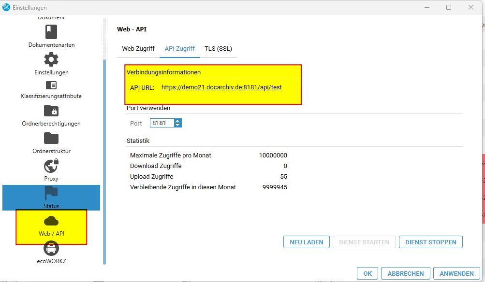
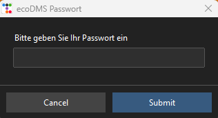

# Erster Programmstart

Beim erstmaligen Start aktivieren Sie das Tool.    
Starten Sie mit einem Klick auf **Aktivieren**.    
Nun startet die Konfiguration des Tools. Bitte halten Sie Ihre Lizenznummer bereit.

- Nun benötigen Sie den Zugang zu Ihrer ecoDMS Installation bzw. dem Pfad zum Server. Zuerst fragt Sie das Tool nach dem API-Zugang von ecoDMS.
       
  Dabei muss der vollständige Pfad zur API angegeben werden, 
  also einschließlich `https://` und `api/` am Ende. 
  Die entsprechende Einstellung können Sie in ecoDMS unter    
  **Einstellungen > Web / API > API Zugriff**    
  nachsehen.    
   
  Lassen Sie das `test` am Ende weg. In diesem Beispiel lautet die Adresse: `https://demo21.docarchiv.de:8181/api/!!!CODE!!!`

- Geben Sie anschließend den ecoMDS-Benutzernamen ein. Achten Sie hierbei auf die Groß- und Kleinschreibung.   

- Geben Sie das ecoDMS-Passwort ein.    
   

- Geben Sie den für das ecoDMS-Tool erhaltenen Lizenzschlüssel ein.   
  *Nicht der EcoDMS-Lizenzschlüssel.*   
     
