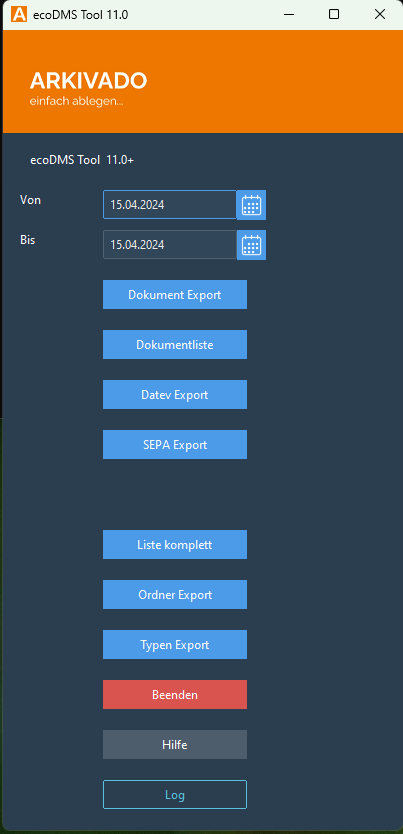

# GUI


Im Tool kann die das Design angepasst werden und  Buttons definiert oder ausgeblendet werden. 
Wird nichts angegeben, werden die Button angezeigt und der Standard Text des Buttons angezeigt.


## Themes 

Das Tool kann in vier verschiedenen Farben dargestellt werden.
Es stehen folgende Desings zur Verfüfung:

### Theme: schwarz (standard)
Für das dunkle  Design muss nichts gemacht werden    


```
  "theme":"schwarz"
```  

### Theme: hell
Für das helle Design in der JSON ```gui``` ->   ```theme ``` auf ```hell``` stellen.   


```
  "theme":"hell"
```  
### Theme: blau
Für das helle Design in der JSON ```gui``` ->   ```theme ``` auf ```blau``` stellen.   


```
  "theme":"blau"
``` 
### Theme: einhorn
Für das helle Design in der JSON ```gui``` ->   ```theme ``` auf ```einhorn``` stellen.   


```
  "theme":"einhorn"
``` 
## GUI Config
``` json title="gui Einstellungen"
   "gui": {
        "theme":"hell",
        "buttons": [
            {
                "funktion": "Dokument Export",
                "text": "Dokument Export",
                "show": true
            },
            {
                "funktion": "Dokumentliste Export",
                "text": "Dokumentliste",
                "show": true
            },
            {
                "funktion": "Datev Export",
                "text": "Datev Export",
                "show": true
            },
            {
                "funktion": "SEPA Export",
                "text": "SEPA Export",
                "show": true
            },
            {
                "funktion": "Dokumentliste Export",
                "text": "Liste komplett",
                "show": true
            },
            {
                "funktion": "Ordner Export",
                "text": "Ordner Export",
                "show": true
            },
            {
                "funktion": "Typen Export",
                "text": "Typen Export",
                "show": true
            }
        ]
    }
```


## Button 
Unter dem Key ```gui``` -> ```buttons``` werden die Knöpfe konfiguiert. 
Es stehen instgesamt 7 Slots für Buttons zur Verfügung.
Die Button sind frei definierbar.

```json title="Abschnitt buttons"
   "gui": {
        "buttons": [
            {
                "funktion": "Dokument Export",
                "text": "Dokument Export",
                "show": true
            },
            {
                "funktion": "Dokumentliste Export",
                "text": "Dokumentliste",
                "show": true
            },
            {
                "funktion": "Datev Export",
                "text": "Datev Export",
                "show": true
            },
            {
                "funktion": "SEPA Export",
                "text": "SEPA Export",
                "show": true
            },
            {
                "funktion": "Dokumentliste Export",
                "text": "Liste komplett",
                "show": true
            },
            {
                "funktion": "Ordner Export",
                "text": "Ordner Export",
                "show": true
            },
            {
                "funktion": "Typen Export",
                "text": "Typen Export",
                "show": true
            }
        ]
    }
```

!!! Warning "Spaltenbreite"
    die Button Breite ist fix. Bitte halten Sie den Text knapp, damit er komplett angezeigt wird. 

\* = Optional

| Opt. | Feld | Beschreibung                                                                                          | Beispielwert                                  |
| ---- | ---- | ----------------------------------------------------------------------------------------------------- | --------------------------------------------- |
| *    | funktion | Der Name der Funktion die ausgeführt werden soll. Der Name muss einer der Funktionen entsprechen                | ```Dokument Export``` |
| *    | text | Der neue Text, der auf dem Button angezeigt wird.                | ```hallo ``` |
| *    | show | Gibt an ob der Button angezeigt werden soll. Wenn nicht, muss show auf false gesetzt werden | ```false```                                  |


!!! tip "Gruppieren"
    Die Button können auch ausgeblendet werden. Wird z.B. der dritte Slot ausgeblendet, entsteht eine Gruppierung. 