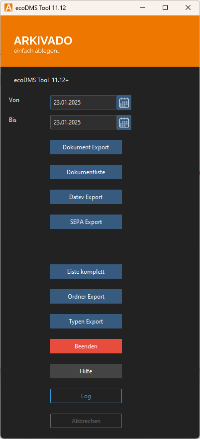

#  Übersicht

<small>Version: 11.10 (Stand 22.11.2024)</small>

## Funktionen

- Erstellung von formatierten Excel-Listen aus den Klassifizierungen der Dokumente
- Berichte erstellen
- Export von CSV Export der Klassifizierung in ecoDMS
- Freie Konfiguration  der Exporte (Filter, Felder, Dokumentlinks). So können auch Daten an weitere Programme übergeben werden wie Simba, Addison, Sage, Lexware uvm.
- Aufruf der Dokumente als Dokumentlink kann übergeben werden
- Export von Dokumenten
- DATEV-Export von Dokumenten inkl. Buchungsdaten an DATEV Unternehmen Online. Der Export wird in ecoDMS am Dokument vermerkt.
- SEPA-Export: Erstellen von Buchungssätzen als SEPA-Datei
- Export der ecoDMS-Ordnerstruktur
- Export der ecoDMS-Dokumentenarten
- Alle Exporte können auch als Kommandozeile manuell oder zeitgesteuert ausgeführt werden.
- Verschiedene Konfigurationen können als Startparameter übergeben werden.
- Oberfläche konfigurierbar, sowohl aussehen als auch Buttons.

Beispiel: Ein Excel Rechnungsliste aus arkivado Tool mit konfiguriertem hellen Design.

Es handelt sich um eine ausführbare Datei, die ohne Installation genutzt werden kann. Sie müssen nur einmalig die Daten zum ecoDMS-Server und Ihre Ablageverzeichnisse konfigurieren.

## Kontakt

Bezüglich Fragen kontaktieren Sie uns:

- [Kontakt](https://www.schlumberger.digital/#Kontaktformular_Startseite)
- [info@schlumberger.digital](mailto:info@schlumberger.digital)

-----------------
schlumberger digital e.K.  
Bauerngasse 30  
90443 Nürnberg  
Telefon 0911-21787-0  
office@schlumberger.digital  
  
Umsatzsteuer-ID-Nr.: DE186952363  
  
Sitz Nürnberg    Amtsgericht Nürnberg    HRA 19745
