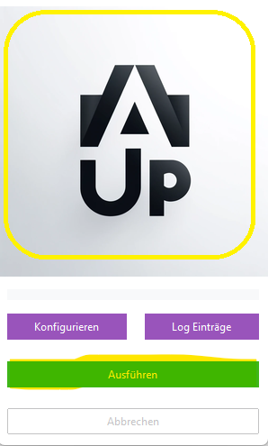

# Sync Starten

Sie können den Sync entweder manuell starten oder das Verzeichnis überwachen lassen.

Bevor Sie syncen können, müssen Sie Ihre ecoDMS Zugangsdaten unter Konfigurierer eingetragen haben. Siehe hier:
[First Run](004config.md)

## Manuell Starten

Zum Sync starten:

- Klicken Sie auf das Logo
- Oder klicken Sie auf "Ausführen"
- Oder drücken Sie ```strg + s```



- Das Programm durchsucht nun das konfigurierte Verzeichnis und alle Unterverzeichnisse nach neuen oder geänderten Dateien.
- Werden neue oder geänderte Dateien gefunden, werden diese zu ecoDMS übertragen.
- Solange das Programm aktiv ist, sehen Sie einen Ladebalken.
- Zudem können Sie auch das Log öffnen. Hier sehen Sie im Detail, was Arkivado Up macht.


## Automatisch

   siehe dazu [Start per Kommandozeile](<007start per Kommandozeile.md>)