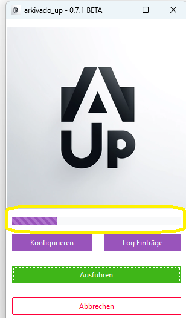

# Sync Starten

Sie können den sync entweder manuell starten oder das Verzeichnis überwachen lassen

bevor Sie Syncen können müssen Sie Ihre ecoDMS Zungangsdaten unter Konfigurierer eingetragen haben siehen hier:
[First Run](004config.md)

## Manuel Starten

Zum Sync start 

- klicken Sie auf das Logo
- oder klicken Sie auf ausführen
- oder drücken Sie ```strg + s ```


- Das Programm dursucht nun das konfigurierte Verzeichnis und alle Unterverzeichnisse nach neuen oder geänderten Datein
- Werden neue oder geänderte Dateien gefunden, werden diese zu ecoDMS übertragen.
- Solange das Programm aktiv ist sehen Sie einen Ladebalken. 
- Zudem können Sie auch das Log öffnen. Hier sehen Sie im detail was Arkivado Up macht. 
