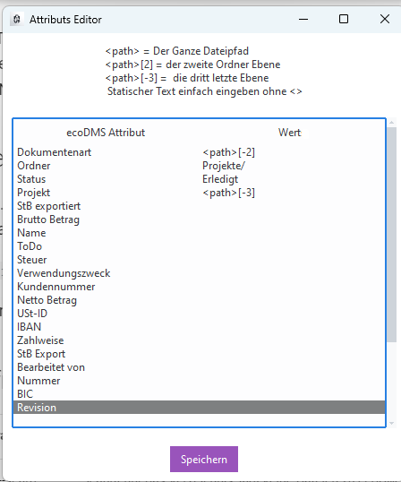

# Mapping

Beim Mapping wird angegeben, welche Felder (Attribute) in ecoDMS befüllt werden.
Dabei kann der Dateipfad verwendet werden, um die Attribute zu befüllen.



Links stehen die Attribute aus ecoDMS und rechts wird angegeben, was eingetragen werden soll.

Dabei wird Text, der eingetragen wird, einfach übertragen. Zum Beispiel: Bei Status steht ```Erledigt```, so werden alle Dokumente mit dem Status *Erledigt* abgespeichert.

Ordnerangaben können Unterordner enthalten, der Unterordner wird dabei mit ```/``` getrennt.
In dem Beispiel werden alle Dokumente unter dem Ordner *Projekte* abgelegt.

## Dynamische Werte

Es können auch abhängig vom Pfad Werte übergeben werden.
Dabei werden dynamische Werte immer in ```<>``` geschrieben.


### Pfad / Ordner verwenden

Für Werte aus dem Pfad steht ```<path>``` zur Verfügung.

Um Teile des Pfades zu verwenden, wird dahinter angegeben, welcher Abschnitt verwendet werden soll.

Hat man zum Beispiel bei einer Datei den Pfad:

```text
C:\Ablage\Projekte\12-22NBG-13\Rechnungseingang\VK123445678.pdf
```

| Eingabe           | Bedeutung                         | Ergebnis                                                               |
| ----------------- | --------------------------------- | ---------------------------------------------------------------------- |
| ```<path>     ``` | Der ganze Pfad                    | ```C:\Ablage\Projekte\12-22NBG-13\Rechnungseingang\VK123445678.pdf``` |
| ```<path>[0]  ``` | Der erste "Ordner"/Laufwerksname  | ```C:\```                                                              |
| ```<path>[1]  ``` | Der zweite "Ordner"               | ```Ablage```                                                           |
| ```<path>[3]  ``` | Der dritte "Ordner"               | ```Projekte```                                                         |
| ```<path>[-1] ``` | Der Dateiname (letzter Abschnitt) | ```VK123445678.pdf```                                                  |
| ```<path>[-2] ``` | Der vorletzte Ordner              | ```Rechnungseingang```                                                 |
| ```<path>[-3] ``` | Der vor-vorletzte Ordner          | ```12-22NBG-13```                                                      |

### Dateinamen


Für den Dateinamen inkl. Dateiendung steht ```<file_name>``` zur Verfügung.


Hat man zum Beispiel bei einer Datei die folgendermaßen heißt:

```text
VK123445678.pdf
```

| Eingabe                   | Bedeutung                                                 | Ergebnis               |
| ------------------------- | --------------------------------------------------------- | ---------------------- |
| ```<file_name>     ```    | Der ganze Dateiname                                       | ```VK123445678.pdf``` |
| ```<file_name>[0]  ```    | Das erste Zeichen im Dateiname                            | ```V```                |
| ```<file_name>[0:3]  ```  | Die ersten drei Zeichen im Dateinamen                     | ```VK1```              |
| ```<file_name>[2:]  ```   | lässt die ersten 2 Zeichen weg bis zum Ende               | ```123445678.pdf```    |
| ```<file_name>[2:-4]  ``` | lässt die ersten 2 Zeichen weg, und die letzten 4 Zeichen | ```123445678```        |
| ```<file_name>[2:11]  ``` | Beginnend mit dem dritten Zeichen bis zum 11ten Zeichen   | ```123445678```        |
| ```<file_name>[-1] ```    | Der letzte Buchstabe                                      | ```f```                |
| ```<file_name>[-2] ```    | Die letzten zwei Buchstaben                               | ```df```               |
| ```<file_name>[-3] ```    | Die letzten drei Buchstaben                               | ```pdf```              |
| ```<file_name>[:-4] ```   | Alles bis auf die letzten 4 Buchstaben                    | ```VK123445678```      |


### Splitting im Dateinname

Wird ein Dateinamen durch Trennzeichen geteilt kann dies verwendet werden. Der Befehl heißt split 

```text
AB_123445678_222.pdf
```


| Eingabe                                | Bedeutung                                                                            | Ergebnis        |
| -------------------------------------- | ------------------------------------------------------------------------------------ | --------------- |
| ```str(<file_name>).split('_')[0]  ``` | trennt Dateinamen bei jedem ```_``` und gibt dann den ersten  gefundenen Wert wieder | ````AB```       |
| ```str(<file_name>).split('_')[1]```   | trennt Dateinamen bei jedem ```_``` und gibt dann den zweiten gefundenen Wert wieder | ```123445678``` |
| ```str(<file_name>).split('_')[2]```   | trennt Dateinamen bei jedem ```_``` und gibt dann den dritten gefundenen Wert wieder | ```222.pdf```   |
| ```str(<file_name>).split('_')[-1]```  | trennt Dateinamen bei jedem ```_``` und gibt dann den letzten gefundenen Wert wieder | ```222.pdf```   |

Wird eine Trennung angegeben die nicht vorhanden ist. 
also z.B. ```str(<file_name>).split('_')[3]```  wird ein leere String zurückgegeben


Für ein komplexes Beipsiel siehe hier: [Dokumentarten aus Dateinamen](<../5. Wissenswertes/FAQ/Dokumentarten aus Dateinamen.md>)

------------------


### Bedingungen (If Then else)

Es können Bedingungen nach dem *Wenn Dann* Prinzip verwendet werden. 


Die Syntax lautet:

< WERT der genommen wird wenn wahr > **if** < hier die Bedingung die Wahr sein muss > **else** < hier der Wert der genommen wird wenn falsch >

``` Python
'Ist gleich' if 'Vergleich' == 'Vergleich' else 'nicht gleich'
```

Das Beispiel würde *Ist gleich*  zurückgeben, da der String *Vergleich* identisch mit *Vergleich*  ist. 


Mögliche Vergleiche:

- ```==```: Ist gleich
- ```!=```: Ist ungleich
- ```<```: Ist keiner (Achtung muss davor in eine Zahl gewandelt werden)
- ```>```: Ist größer (Achtung muss davor in eine Zahl gewandelt werden)
- ```in ```: Mehrere Strings vergleichen 


Nun kommen einige praktische Beispiele wie man die If Abfragen verwenden kann

#### Beispiele

Angenommen der Status einens Dokuments soll auf *Nicht freigegeben* gesetzt werden, wenn der Ordner indem das Dokument liegt *Entwurf* heißst.
```text
C:\Ablage\Projekte\12-22NBG-13\Zeichnungen\Entwurf\Zeichnung1234.pdf
```

**Code** 

``` Python
'Nicht freigegeben' if <path>[-2] == 'Entwurf' else 'Erledigt'
```
**Beschreibung**

prüft ob der letzte Ordner im  Pfad ( im Beispiel *Entwurf*) ```Entwurf``` heißt. und gibt *Nicht freigegeben* zurück, weil der Ordner *Entwurf* heißt.
 
**Ergebnis**

```Nicht freigegeben``` 

--------------------

**Code** 

``` Python
'Nicht freigegeben' if <path>[-2] == 'archiv' else 'Erledigt'
```
**Beschreibung**

prüft ob der letzte Ordner im  Pfad ( in den Beispiel *Entwurf*) ```archiv``` heißt und gibt *Erledigt* zurück, da *Entwurf* ist nicht gleich dem Wort *archiv* ist.          
 
**Ergebnis**

```Erledigt```    

---------------------

**Code** 

``` Python
'Entwurf' if <path>[-2] != 'Entwurf' else 'Erledigt'
```
**Beschreibung**

 prüft ob der letzte Ordner im  Pfad ( in den Beispiel *Entwurf*) **nicht** ```Entwurf``` heißt. und gibt *Erledigt* zurück.
 
**Ergebnis**

```Erledigt``` 

------------------


**Code** 

``` Python
'Nicht freigegeben' if <path>[-2] == 'entwurf' else 'Erledigt'
```
**Beschreibung**

Prüft ob der letzte Ordner im  Pfad ( in den Beispiel *Entwurf*) ```entwurf``` heißt und gibt *Erledigt* zurück. *Entwurf* ist nicht gleich *entwurf*: Groß- und Kleinschreibung ist relevant!
 
**Ergebnis**

```Erledigt``` 

------------------


**Code** 

``` Python
'Nicht freigegeben' if str(<path>[-2]).lower() == 'entwurf' else 'Erledigt'
```
**Beschreibung**

prüft ob der letzte Ordner im  Pfad ( in den Beispiel *Entwurf*) ```entwurf``` heißt, wobei der Pfad kleingeschieben wird ( Funktion: ```.lower()```) daurch wird der Vergleich Case Insenitv. 
 
**Ergebnis**

```Nicht freigegeben``` 


------------------


**Code** 

``` Python
'Nicht freigegeben' if str(<path>[-2]).lower() in ('entwurf','sperre','privat') else 'Erledigt'
```
**Beschreibung**

prüft ob der letzte Ordner im  Pfad ( in den Beispiel *Entwurf*) entwerder ```entwurf```, ```sperre``` oder ```privat``` heißt, wobei der Pfad kleingeschieben wird ( Funktion: ```.lower()```) daurch wird der Vergleich Case Insenitv. 
 
**Ergebnis**

```Nicht freigegeben``` 


----------

### Case (Werte ersetzen)

Oftmals will man Label setzen, bei dem z.B. in dem Pfad ein AN steht aber die Dokumentart Angebot heißt.

Die *nachschlage Tabelle* ist in ```{} ``` geschreiben, wobei immer der Wert aus der Tabelle in  ```' ``` geschreiben wird. Der Wert der stattessen ausgegeben werden soll wird mit einem  ```: ``` angegbeen. 


``` Python
{'Ursprungswert1':'ersatzwer1','ursprungswert2':'ersatzwert2', 'Ursprungswert3':'ersatzert3'}.get(<MeinEcoDMS Feld>, 'Mein Wert wenn nichts passt')
``` 

#### Beispiele


ein Typisches Bespiel ist der Letzte Ordner im Verzeichis enhälent die Dokumentart. Allerdings steht dort nur AB statt Auftragsbestätigung. 
```text
C:\Ablage\Projekte\12-22NBG-13\AB\Auftag-1234.pdf
```

**Code** 

``` Python
{'AN':'Angebot/','LS':'Lieferschein/','AB': 'Auftragsbestätigung/','RG':'Rechnungsausgang/','BE':'Bestellung/'}.get(<path>[-2], '#Eingangskorb#/')
```
**Beschreibung**

Prüft den letzten Ordner   ```<path>[-2] ``` also in unserem Beispiel ```AB``` schaut in seiner Tabelle nach:

 ```
 {'AN':'Angebot/','LS':'Lieferschein/','AB': 'Auftragsbestätigung/','RG':'Rechnungsausgang/','BE':'Bestellung/'}
 ``` 
 
 findet den Wert ```AB``` und gibt  ```Auftragsbestätigung/``` aus. Hätte er nichts gefunden, würde er den Odner ```#Eingangskorb#/``` nehmen. 

!!!tip
    Bei Ordnerangaben für ecoDMS müssen immer mit ```/``` aufhören.  
 
**Ergebnis**

```Auftragsbestätigung/``` 
