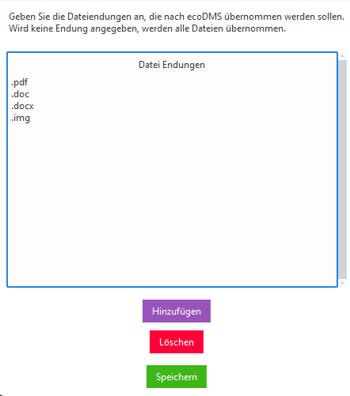

# Datei Endungen Whitelist

## Filter Einstellungen

Es ist ratsam nicht alle Dateitypen nach ecoDMS zu übernehmen. z.B. Programme und Backups sollten nicht übertragen werden. 
Hierfür kann ein Filter definiert werden. 

!!!tip  
    wird keine Endung angegeben werden alle Dateien übernommen





- Drücken Sie ```Enter``` oder auf ```Hinzufügen``` um eine neue Dateiendung hinzuzufügen. 
- Markieren Sie eine Endung und klicken Sie auf ```Löschen``` um die Dateiendung aus der Liste zu entfernen
- Mit Doppelklick auf einen Eintrag können Sie diesen ändern

ist die Liste fertig klicken Sie auf ```Speichern```


## Typische Filter Liste

Diese Filterliste enthält, Pdfs, Office Dokument und Emails

- pdf 
- doc
- docx
- pptx
- ppt
- odp
- msg
- eml
- xls
- xl
- img
- jpg
- png
- ods
- txt
- csv
- rtf