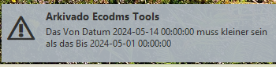

# Datumsfehler


## Problembeschreibung

- Das Tool startet 
- Beim Klick auf irgendeine Taste kommt eine Fehlermeldung im unteren Bereich

``` title="Zertifikatsfehler im Log"
22024-05-14 10:15:59,036 - CRITICAL - Das Von Datum 2024-05-14 00:00:00 muss kleiner sein als das Bis 2024-05-01 00:00:00 
``` 



## Erklärung

Das ausgwählte Datum in der Obefläche ist falsch. 
Das ```Von``` Datum muss vor dem ```Bis``` Datum liegen. 


## Lösung 
Wählen Sie ein Datum im Bis aus, dass entweder gleich dem von Datum ist oder weiter in der Zukunft liegt. 