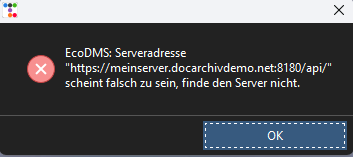

# Verbindungsfehler: falscher URL


## Problembeschreibung

- Das Tool startet 
- Beim Klick auf irgendeine Taste kommt eine Fehlermeldung

``` title="Verbindungsfehler im Log"
2024-05-14 10:08:04,830 - CRITICAL - EcoDMS: Serveradresse "https://meinserver.docarchivdemo.net:8180/api/" scheint falsch zu sein, finde den Server nicht. 
2024-05-14 10:08:32,215 - CRITICAL -  Ein Fehler bim Verbinden mit ecoDMS ist aufgetreten. Prüfen Sie das Log.
``` 



## Erklärung

Das arkivado up versucht sich mit ecoDMS zu verbinden und stellt dabei fest, dass der Server nicht gefunden wird.


## Lösung 

Konfigurieren Sie die Serveradresse in der Konfiguration um:
siehe [Konfiguration](<../../3. Konfiguration/004config.md>)