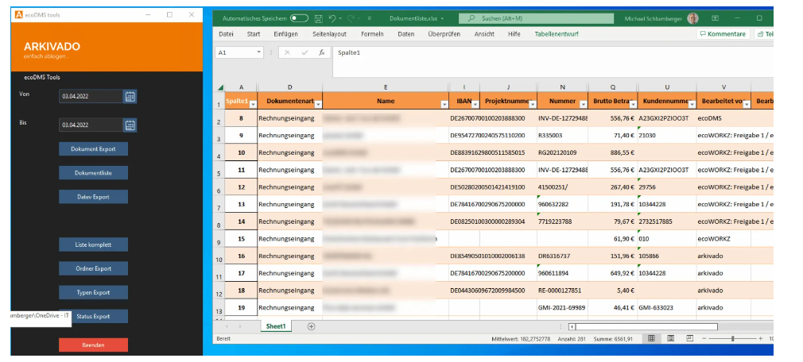

#  Übersicht

<small>Version: 0.7.0 (Stand 05.06.2024)</small>

!!! info "Beta Status"
    Diese Dokumentation und das Programm befindet sich derzeit im Aufbau. Fagen, oder etwas unklar? [Kontakt aufnehmen](mailto:info@schlumberger.digital)

## Funktionen

- Syncen Sie Verzeichnisse von der Lokalen Festplatte nach ecoDMS
- Ändert sich eine Datei wird eine neue Version in ecoDMS angelegt 
- Das Tool erkennt automatisch ob die Datei bereits vorhanden ist
- Teile des Pfades können als Atttribute verwerndet werden. 

Es handelt sich um eine ausführbare Datei, die ohne Installation genutzt werden kann. Sie müssen nur einmalig die Daten zum ecoDMS-Server und Ihre Ablageverzeichnisse konfigurieren.

## Kontakt

Bezüglich Fragen kontaktieren Sie uns:

- [Kontakt](https://www.schlumberger.digital/#Kontaktformular_Startseite)
- [info@schlumberger.digital](mailto:info@schlumberger.digital)

-----------------
schlumberger digital e.K.  
Bauerngasse 30  
90443 Nürnberg  
Telefon 0911-21787-0  
office@schlumberger.digital  
  
Umsatzsteuer-ID-Nr.: DE186952363  
  
Sitz Nürnberg    Amtsgericht Nürnberg    HRA 19745
