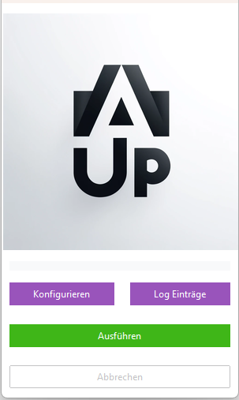

#  Übersicht

<small>Version: 1.2.0 (Stand 06.11.2024)</small>

Importieren Sie ganze Verzeichnisse nach ecoDMS. Ändert sich ein Dokument, wird es als Version in ecoDMS archiviert. Einmalig, intervall gesteuert oder kontinuirlicher Import möglich. Dabei können Orndername (z.B. Projektnummer) als Attribute nach ecoDMS übergeben werden.
Egal, wo sich der Server befindet.

Von: 

Zu:

## Funktionen

- Synchronisieren Sie Verzeichnisse von der lokalen Festplatte nach ecoDMS.
- Ändert sich eine Datei, wird eine neue Version zum selben Dokument in ecoDMS angelegt.
- Das Tool erkennt automatisch, ob die Datei bereits vorhanden ist.
- Teile des Pfades oder des Dateinamens können als Attribute verwendet werden.
- Kann  Verzeichnisse auch überwachen, um in Echtzeit hochzuladen.
- ecoDMS kann lokal oder in der Cloud betrieben werden, lediglich die API muss erreichbar sein.
- Dateiendungs-Whitelist möglich.
- Nur eine .exe-Datei, keine Installation nötig.
- Schnellstart: Sie müssen nur einmalig die Daten zum ecoDMS-Server und Ihr Ablageverzeichnis konfigurieren.

## Kontakt

Bezüglich Fragen kontaktieren Sie uns:

- [Kontakt](https://www.schlumberger.digital/#Kontaktformular_Startseite)
- [info@schlumberger.digital](mailto:info@schlumberger.digital)

-----------------
schlumberger digital e.K.  
Bauerngasse 30  
90443 Nürnberg  
Telefon 0911-21787-0  
office@schlumberger.digital  
  
Umsatzsteuer-ID-Nr.: DE186952363  
  
Sitz Nürnberg    Amtsgericht Nürnberg    HRA 19745
