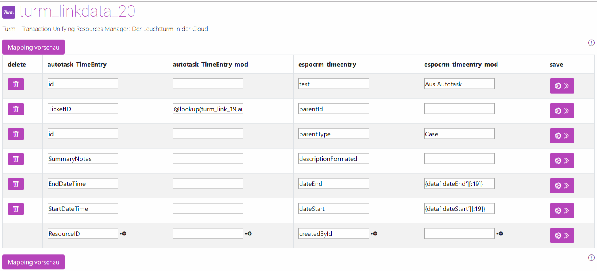
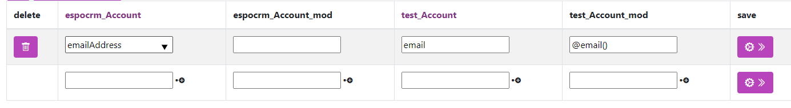

# String
*Stand: Turm Version 14.22.1 - 01.02.2024*


## Zeichen manipulieren
Um die Länge eines Strings zu begrenzen oder um den Anfang eines Strings abzuschneiden, verwenden Sie die Notation `[]`. 

Beispielsweise, um aus dem Feld `Bemerkung` nur die ersten 255 Zeichen auszugeben, fügen Sie `[:255]` hinzu, wie folgt:
```
{data['Bemerkung'][:255]}
```
Hierbei werden die Zeichen vom Anfang bis zum 255. Zeichen ausgegeben.

Um die ersten Zeichen eines Strings zu überspringen, verwenden Sie die Notation `[n:]`, wobei `n` die Anzahl der zu überspringenden Zeichen angibt. Wenn Sie beispielsweise die ersten drei Zeichen überspringen und den restlichen Teil des Strings ausgeben möchten, verwenden Sie:
```
{data['Bemerkung'][3:]}
```

Eine Kombination beider Methoden ist ebenfalls möglich. Angenommen, die `Bemerkung` enthält den String *12345678901234567890*, und Sie möchten den Teil des Strings vom 4. bis zum 10. Zeichen (einschließlich) extrahieren, verwenden Sie:
```
{data['Bemerkung'][3:10]}
```
Das Ergebnis wäre *4567890*. Hierbei zählen die ersten drei Zeichen (123) mit, und es werden die Zeichen von der 4. bis zur 10. Position des ursprünglichen Strings ausgegeben.


## E-Mail-Adressen bereinigen

Bei der Übertragung unsauberer E-Mail-Adressen aus einer Quelle kann die Funktion `@email` zur korrekten Darstellung genutzt werden:

```
@email(Ersatzwert, optionales Regex-Muster)
```

Diese Funktion durchsucht den String nach E-Mail-Adressen und gibt die erste gefundene Adresse aus. Falls keine E-Mail-Adresse gefunden wird, kann ein vordefinierter Ersatzwert verwendet werden.

In den meisten Fällen genügt der einfache Aufruf:
```
@email()
```


| Feld            | Bedeutung                                                                     | Beispiel      |
|-----------------|-------------------------------------------------------------------------------|---------------|
| Ersatzwert      | Wird verwendet, falls keine E-Mail-Adresse gefunden wird. "Leer" gibt None/Null zurück. |               |
| fallback_date   | Optional: Gibt an, welches Datum verwendet werden soll, falls die Umwandlung nicht erfolgt. Wird nichts angegeben, wird ein leerer String zurückgegeben. Variable Datumsangaben sind möglich. | `get_now()` |

Beispiel:

Aus:
```
Meine E-Mail lautet: info@turm.ai. Schreib mir, oder an die weis.ich@nicht.de.
```

Wird:
```
info@turm.ai
```

zudem korrigiert der Turm automatisch Umlaute, so wird aus:

`müller@beispiel.de`, `mueller@beispiel.de`

## Telefonnummern bereinigen

Zur korrekten Darstellung unsauber übertragener Telefonnummern kann die Funktion `@phone` eingesetzt werden:

```
@phone(<Ersatzwert>, <FORMAT>, <LANDESKENNZEICHEN>)
```

Diese Funktion sucht im String nach Telefonnummern und gibt die erste gefundene Nummer aus. Wird keine Telefonnummer gefunden, lässt sich ein vordefinierter Ersatzwert nutzen.

Die Telefonnummer wird dabei in ein einheitliches Format überführt. Folgende Formate stehen zur Verfügung:

- E164 (+49911123456)
- NATIONAL (0911 123456)
- INTERNATIONAL (49 911 123456)

Wird kein Format spezifiziert, wird standardmäßig das Format NATIONAL für Deutschland angenommen.

In den meisten Fällen ist folgender einfacher Aufruf ausreichend:
```
@phone()
```

| Feld                   | Bedeutung                                                                         | Beispiel  |
|------------------------|-----------------------------------------------------------------------------------|-----------|
| `<Ersatzwert>`         | Wird verwendet, falls keine Telefonnummer gefunden wird. "Leer" gibt None/Null zurück. | `None`    |
| `<FORMAT>`             | Optional: Legt das zu verwendende Telefonnummernformat fest (siehe oben).         | `NATIONAL`|
| `<LANDESKENNZEICHEN>`  | Optional: Gibt das Standardland an, falls keine Vorwahl vorhanden ist.            | `DE`      |

Beispiel, aus dem String:

```
+49911 12 235 67
```

wird mit `@phone()`:

```
0911 1234567
```

## Überprüfung von URLs

Für die korrekte Darstellung fehlerhaft übertragener Webseiten kann die Funktion `@url` verwendet werden:

```
@url(<Ersatzwert>, <BrauchtProtokoll>, <UnicodeOk>)
```

| Feld             | Bedeutung                                                                                                            | Beispiel  |
|------------------|----------------------------------------------------------------------------------------------------------------------|-----------|
| `<Ersatzwert>`   | Wird eingesetzt, falls keine Web-URL gefunden wird. "Leer" gibt `None`/`Null` zurück.                               | `None`    |
| `<BrauchtProtokoll>`   | Optional: Gibt an, ob ein Protokoll wie z.B. `http://` zu Beginn erforderlich ist. Ohne `True` sind Definitionen wie `www.beispiel.de` ungültig. Mögliche Werte: `True` oder `False`. Standardmäßig ist es `False`. | `False` |
| `<UnicodeOk>`    | Optional: Bestimmt, ob Umlautdomains gemäß des neueren Standards erlaubt sind (ASCII only). Mit `True` ist z.B. `http://www.nürnberg.de` gültig, mit `False` aufgrund des `ü` nicht. Standardmäßig ist es `False`. | `False` |

Beispiel:

Aus dem String:
```
www.nürnberg.de
```

wird mit `@url(Nicht angegeben)`:
```
nicht angegeben
```

Mit `@url(Nicht angegeben, True, True)` wird:
```
www.nürnberg.de
```
