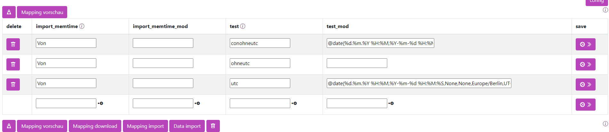

# Datum


## Datumsangaben anpassen

Um Datumsangaben beliebig zu formatieren, kann der folgende Befehl verwendet werden:

```
@date(source_date_format, target_date_format, fallback_date, source_field, source_timezone, target_timezone)
```

| Feld               | Bedeutung                                                                                          | Beispiel        |
|------------------- |---------------------------------------------------------------------------------------------------|-----------------|
| source_date_format | Das Format, in dem die Daten angegeben sind. Soll ein Komma verwendet werden, bitte ein Pipe-Symbol (```|```) schreiben. Um wirklich ein Pipe-Symbol (```|```) zu schreiben, bitte zwei Pipe-Symbole (```||```) verwenden. | `%Y-%m-%d`  |
| target_date_format | Das Format für das Zielsystem. Soll ein Komma verwendet werden, bitte ein Pipe-Symbol (```|```) schreiben. Um wirklich ein Pipe-Symbol (```|```) zu schreiben, bitte zwei Pipe-Symbole (```||```) verwenden. | `%Y-%m-%d`  |
| fallback_date      | Optional: Das Datum, das verwendet werden soll, wenn die Umwandlung nicht erfolgreich ist. Wird nichts angegeben, wird ein leerer String übergeben. Variable Datumsangaben sind möglich. | `get_now()` |
| source_field       | Optional: Wenn ein anderes Feld zur Berechnung herangezogen werden soll, kann hier ein abweichendes Feld angegeben werden. Wird nichts angegeben, wird das Feld der Zeile verwendet. | |
| source_timezone    | Optional: Die Zeitzone, in der die Zeit eingegeben ist. Dies ist nur wichtig, wenn in eine andere Zeitzone konvertiert werden soll, z.B. in UTC. Alle Zeitzonen sind [hier](04_functions_datetimezones.md) zu finden. | `Europe/Berlin` |
| target_timezone    | Optional: Die Zeitzone, zu der die Zeit konvertiert werden soll, z.B. in UTC. Alle Zeitzonen sind [hier](04_functions_datetimezones.md) zu finden. | `UTC` |

Hierbei kann ein Datumsfeld in ein anderes Format überführt werden.

- `%Y` = Jahr mit Jahrhundert, z.B.: 2023
- `%m` = Monat mit führender Null, z.B.: 01 oder 12
- `%d` = Tag mit führender Null, z.B.: 01 oder 31
- `%H` = Stunde (24-Stunden-Format) mit führender Null, z.B.: 01 bis 23
- `%M` = Minute mit führender Null, z.B.: 01 oder 59
- `%S` = Sekunde mit führender Null, z.B.: 01 oder 59
- `%f` = Millisekunde mit führenden Nullen, z.B.: 000001 bis 999999
- `%z` = Zeitzonen-Offset zur UTC ±HHMM[SS[.ffffff]], z.B.: +0200 (Deutsche Sommerzeit)
- `%y` = Jahr ohne Jahrhundert, z.B.: 23

Nur beim Zielsystem:

- `%-m` = Monat ohne führende Null, z.B.: 1 oder 12
- `%-d` = Tag ohne führende Null, z.B.: 1 oder 31
- `%-H` = Stunde (24-Stunden-Format) ohne führende Null, z.B.: 1 bis 23
- `%-M` = Minute ohne führende Null, z.B.: 1 oder 59
- `%-S` = Sekunde ohne führende Null, z.B.: 1 oder 59

Beispiele:
```
%Y-%m-%d wird zu 2023-12-31
%Y.%m.%d wird zu 31.12.2023
%Y-%m-%d %H:%M:%S wird zu 2023-12-31 15:23:01
```

## Heutiges Datum festlegen

Um das aktuelle Datum einzufügen, kann folgendes verwendet werden:
```
get_now()
```

## Dynamisches Datum

Es ist auch möglich, das Datum dynamisch zu berechnen, zum Beispiel:

- Für morgen:
  ```
  get_now({'days': 1})
  ```
- Für gestern:
  ```
  get_now({'days': -1})
  ```
- Für die nächste Woche:
  ```
  get_now({'weeks': 1})
  ```

Mögliche Werte zum Hinzufügen zu Datumsangaben:

- `weeks` = Wochen
- `days` = Tage
- `hours` = Stunden
- `minutes` = Minuten
- `seconds` = Sekunden
- `milliseconds` = Millisekunden
- `microseconds` = Mikrosekunden
