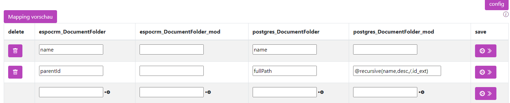
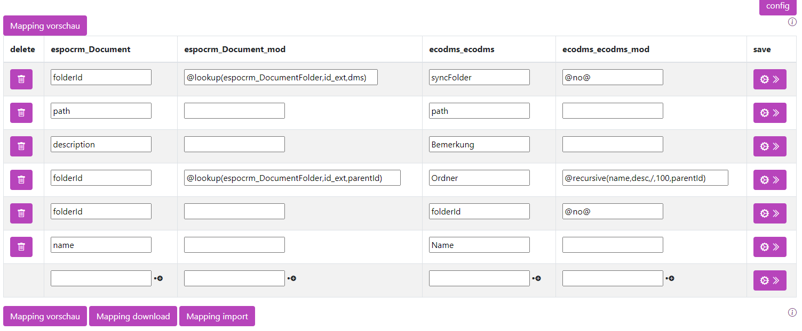
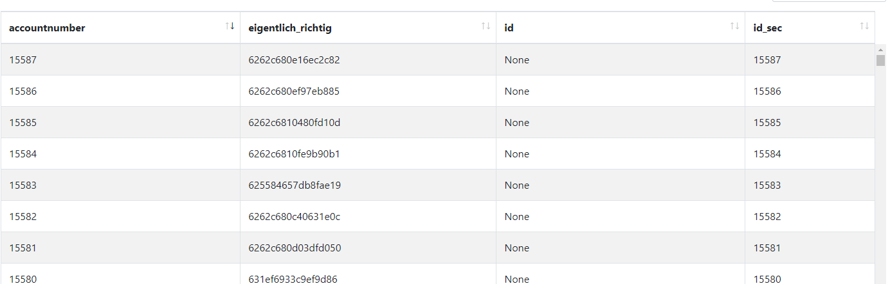
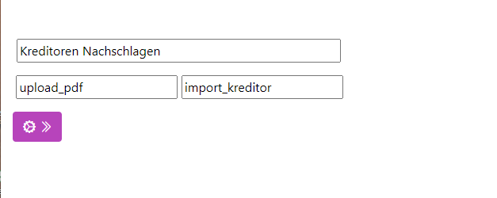
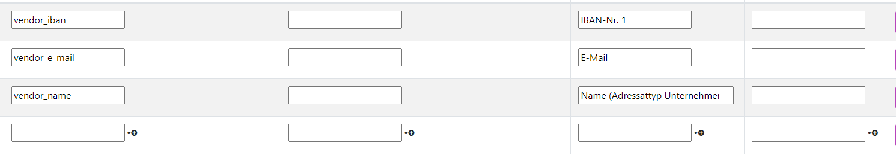
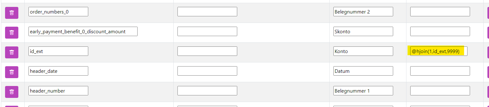

# Lookups 
*Stand: Turm Version 15.0.0 - 18.03.2024*

## Mapping: Nachschlagen von Werten aus anderen Tabellen Lookup

Um einen Wert in einer anderen Tabelle nachzuschlagen, wird der Befehl `@lookup` verwendet.

```
 @lookup(tabellenname, referenzwert, zusetzenderWert, <Optional ORDER>, <Optional WHERE>, <Optional MAX>)
```

| Name             | Bedeutung                                                                                                     | Beispiel                                                                      |
|------------------|---------------------------------------------------------------------------------------------------------------|-------------------------------------------------------------------------------|
| tabellenname     | Der Name der Tabelle im Turm.                                                                                 | `espocrm_Account`                                                             |
| referenzwert     | Der Name der Spalte, die in der vorher genannten Tabelle denselben Wert hat wie die Ursprungstabelle. **Profi-Tipp**: Mehrere Spalten können mittels `AND` verbunden und der SQL-Befehl direkt geschrieben werden. | Einfach: <br> `id_ext` <br> Mit mehreren Spalten:<br> `id_ext AND customer_id = "espocrm_conctacts"."account_id"` |
| zusetzenderWert  | Der Name der Spalte, die im Zielsystem angezeigt werden soll.                                                 | `name`                                                                        |
| Optional ORDER   | Die Sortierung in der Lookup-Tabelle, z.B. bei Positionen einer Rechnung. Die Sortierung erfolgt mit `desc` absteigend und `asc` aufsteigend. | `name desc`                                                                   |
| Optional WHERE   | Setzt einen zusätzlichen Filter auf die Lookup-Tabelle.                                                       | `name IS NOT NULL`                                                            |
| Optional MAX     | Wenn mehr als ein Wert gefunden wird, kann hier die Anzahl begrenzt werden.                                   | `1`                                                                           |

Ein typisches Szenario: Firmen und Personen werden synchronisiert. Zuerst werden die Firmen und dann die Personen übertragen. Dabei muss im Zielsystem die Firmen-ID des Fremdsystems übergeben werden. Also werden z.B. Personen aus der Tabelle `at_contact` an `espo` übertragen und in die Tabelle `espocrm_contact` eingetragen. Dabei stehen die Firmen in der Tabelle `at_account`, die über den `turm_link` mit der Nummer 8 mit `espocrm_account` verknüpft sind.

Um die Firmen-ID, die in `espo` steht, zu übergeben, muss folgendes eingestellt werden:

!!! warning "In der ersten Modifikationsspalte"
    Der Befehl muss in der ersten Modifikationsspalte eingegeben werden. 

| at_contact       | at_contact_mod                                            | espocrm_contact | espocrm_contact_mod |
|------------------|-----------------------------------------------------------|-----------------|---------------------|
| accountid        | @lookup(turm_link_8, at_account_id, espocrm_account_id)   | accountid       |                     |

Z.B. führt der Befehl
```
@lookup(turm_link_8, at_account_id, espocrm_account_id)
```
dazu, dass der Wert der ersten Spalte in der Tabelle `turm_link_8` verwendet wird.

### Lookup nur eines Wertes

Es kann vorkommen, dass in der Nachschlagetabelle mehrere passende Werte gefunden werden, z.B. wenn es eine IBAN-Liste für den Kunden gibt, aber nur die erste IBAN genommen werden soll. Wird nichts weiter angegeben, werden die Daten mehrfach ausgegeben. Bei den Firmen würde die Firma dann mehrfach in der Liste mit verschiedenen IBANs auftauchen. Um nur einen Wert zu übergeben und nicht mehrere, müssen mehr Informationen übergeben werden:
1. Wie soll die Unterliste sortiert sein?
2. Gibt es optionale Ausschlüsse? Also z.B. inaktive nie berücksichtigen.
3. Wie viele Einträge sollen ausgesucht werden? Standardmäßig unendlich.

```
 @lookup(tabellenname, referenzwert, zusetzenderWert, <Optional ORDER>, <Optional WHERE>, <Optional MAX>)
```

#### Optional ORDER

Der Wert ist ein String und gibt an, wie sortiert werden soll.

Wenn es z.B. das Feld `nr` in der Nachschlagetabelle gibt, kann nach der Nummer sortiert werden. Dabei erfolgt die Sortierung mit `desc` absteigend und `asc` aufsteigend.

Also:
```
 @lookup(turm_link_8, at_account_id, espocrm_account_id, "nr" desc)
```

Es können auch mehrere Sortierungen mit `|` getrennt angegeben werden.

```
"nr" desc | "create_date" asc
```

```
 @lookup(turm_link_8, at_account_id, espocrm_account_id, "nr" desc | "create_date" asc)
```

#### Optional WHERE

Die Untertabelle kann auch gefiltert werden. Angenommen, die Untertabelle hat eine Aktiv-Spalte und es sollen nur Werte berücksichtigt werden, die eine 1 haben, dann lautet die Bedingung:
```
aktiv = 1
```
**und**-Verknüpfungen werden mit `and` geschrieben, **oder**-Verknüpfungen mit `or`. Für Aktiv und Kunde als Typ würde der gesamte Befehl dann lauten:
```
 @lookup(turm_link_8, at_account_id, espocrm_account_id, "nr" desc | "create_date" asc, aktiv = '1' and "typ" = 'Kunde')
```

#### Optional MAX

Gibt an, wie viele Nachschlagewerte zurückgegeben werden. Standardmäßig ist dies **1**, wenn nichts angegeben wird. In den meisten Fällen ist 1 der richtige Wert. Denkbar sind höhere Werte für Ranglisten wie die Top 3. Meist ist jedoch der rekursive Lookup weiter unten besser geeignet.


## Mapping: Nachschlagen nach IDs 

sehen Sie hierzu den [hier](07_functions_lookup.md)


## Mapping: Recursiv Nachschlagen 

Ein typisches Szenario: Eine Ordnerstruktur ist in der Datenbank abgelegt. Dabei ist jeder Ordnername ein Eintrag.

| id_ext | name         | parentid |
|--------|--------------|----------|
| 1      | Basis        |          |
| 2      | Unterordner  | 1        |

Die Pfade sollen nur für *Unterordner* so lauten: `Basis\Unterordner`.

Dabei verweist die Spalte `Parentid` auf die Spalte `ID`. Somit weiß man, dass der Unterordner dem Basisordner untergeordnet ist. Der Befehl `@recursive` kann dies zusammensetzen.

Dabei werden alle Parents in der Datenbank ausgelesen und zu einem String zusammengesetzt.

!!! warning "Gecachte Wiederholungen"
    Das Ergebnis wird im Arbeitsspeicher des Turms gespeichert. Um neue Ergebnisse zu bekommen, bitte den Cache leeren. 

 

| espocrm_Document | at_contact_mod | espocrm_contact | espocrm_contact_mod |
|------------------|----------------|-----------------|---------------------|
| parentId         |                | fullPath        | @recursive(name, desc, /, id_ext) |

Durch den Befehl wird die `parentId` aus der ersten Spalte in der Spalte `id_ext` gesucht und der `name` ausgegeben. Dabei wird zuerst der in der Hierarchie obenliegende ausgegeben und die Daten mit einem `/` verbunden.

Die Syntax lautet:
```
 @recursive(column, order, separator, limit, original_column)
```

| Spalte           | Beschreibung                                                                                       | Beispiel                        |
|------------------|----------------------------------------------------------------------------------------------------|---------------------------------|
| column           | Der Name der Spalte, die ausgegeben wird, wenn eine Verknüpfung gefunden wird.                     | name                            |
| order            | [Optional] asc: Gibt an, wie die Sortierung erfolgt. Möglich ist **asc** (aufsteigend) oder **desc** (absteigend). Damit wird angegeben, ob von kleinstem zum Größten (also *Unterordner/Basis*) oder vom Großen zum Kleinen (*Basis/Unterordner*) sortiert wird. | asc                             |
| separator        | [Optional]: Wie werden die einzelnen Werte miteinander verbunden, z.B. für einen Bindestrich `-`.   | /                               |
| limit            | [Optional] -1: Gibt an, wie oft nachgeschlagen wird (maximale Rekursion). -1 = Unendlich. Achtung, wird ein Loop gebaut und keine Begrenzung angegeben, wird auch unendlich die DB abgefragt. | -1                              |
| original_column  | [Optional]: Nur wichtig, wenn in einer anderen Tabelle gesucht wird, also in Verbindung mit `@lookup`. Dann wird hier die Spalte in der Fremdtabelle angegeben. | parentId                        |

!!! warning "In der zweiten Modifikationsspalte"
    Der Befehl muss in der zweiten Modifikationsspalte eingegeben werden. 

Der einfachste Aufruf lautet:
```
@recursive(<SPALTENNAME>)
```
So wird bei dem oben genannten Beispiel
```
@recursive(name)
```
folgendes ausgegeben:


```
Unterorder,Basis
```


### Rekursiver Lookup mit `@lookup`

Ein rekursiver Lookup in einer Fremdtabelle ist ebenfalls möglich:

 

| espocrm_Document       | espocrm_Document_mod                     | espocrm_contact | espocrm_contact_mod                      |
|------------------------|------------------------------------------|-----------------|------------------------------------------|
| folderId               | @lookup(espocrm_DocumentFolder, id_ext, parentId) | Ordner          | @recursive(name, desc, /, 100, parentId) |

In diesem Fall wird die `folderId` (4. Zeile) über ein `@lookup` in der Tabelle `espocrm_DocumentFolder` nachgeschlagen. Anschließend wird der rekursive Lookup in der Tabelle `espocrm_DocumentFolder` durchgeführt. Dabei wird aus der Tabelle `espocrm_DocumentFolder` die Spalte `name` genommen, mit `/` verbunden und als Verbindungsid wird die Spalte `parentId` verwendet. Zum Schluss wird das Ergebnis für die `folderId` in der ersten Spalte herangezogen.

## Eine andere externe ID angeben 

In seltenen Fällen soll eine andere ID für das Fremdsystem angegeben werden, z.B. wenn:
- Die Firmendaten an eine Fakturierung übergeben werden.
- Die Fakturierung erzeugt eine Kundennummer.
- Nun soll nur die Kundennummer zurückgeschrieben werden.
- Dafür wird ein weiteres Mapping angelegt.
- Soll nun die ursprüngliche ID aus dem ersten Mapping übergeben werden, muss die ID angepasst werden.

 

In der Beispiel-Tabelle soll die Spalte `eigentlich_richtig` als externe ID verwendet werden, stattdessen wird die falsche ID ausgegeben.

Der Turm mapped automatisch die Daten mit dem, was er intern beim Syncen bekommen hat, in die `id_sec`. In diesem speziellen Fall kommt die `id_sec` allerdings aus einem anderen Mapping (im Beispiel aus dem Mapping mit der Nr. 10). Es muss also die ID aus dem Mapping Nr. 10 als externe ID übergeben werden. Dafür wird:
- Ein `@lookup` mit der ID auf Nr. 10 durchgeführt.
- Die Account-ID aus dem Mapping übergeben.
- Dem Turm der Spaltenname `id_sec` gegeben.

Anschließend wird dem Turm über den Namen `id_sec` gesagt, dass es sich um die ID im Fremdsystem handelt.

| fakturia_Customers | fakturia_Customers_mod                     | espocrm_Account | espocrm_Account_mod |
|--------------------|--------------------------------------------|-----------------|---------------------|
| id_ext             | @lookup(turm_link_10, fakturia_Customers_id, espocrm_Account_id) | id_sec             |                     |

Nun wird dem Fremdsystem die korrekte ID übergeben.

!!! tip "Tipp"
      Dem Turm steht fürs Mapping die ursprüngliche ID unter `id_sec_internal` zur Verfügung. Nach extern wird der Name entfernt. 

 

Nachdem das Mapping angelegt wurde, wird in den meisten Fällen ein Workflow angelegt, denn: Ein Mapping ist die Vorschrift, wie die Daten vom Turm in das Fremdsystem kommen.


## Hierarchischer Join (hjoin)

Manchmal, insbesondere in der KI, müssen mehrere Kriterien für einen Join geprüft werden. Hierbei wird zunächst das erste Kriterium geprüft, und falls dieses nicht passt, wird das nächste Kriterium herangezogen. 

Dies ist besonders sinnvoll, wenn beispielsweise eine Tabelle mit Kreditoren besteht und eine von der KI klassifizierte Rechnung dem entsprechenden Kreditor zugeordnet werden soll.

Für diesen Vorgang müssen folgende Schritte durchgeführt werden:

1. Importieren der Nachschlagedaten, z.B. einer Kreditorenliste. Dies kann beispielsweise mit einem Schiff erfolgen.
2. Erstellen eines hjoin-Mappings.
3. Auswählen der Spalten, die als Kriterium dienen.
4. Anwenden des hjoin im Mapping.

Nachdem der erste Schritt abgeschlossen ist, wird das hjoin-Mapping angelegt. Hierfür legen Sie ein neues Mapping an:

### Neuen hjoin anlegen



Navigieren Sie zu:

```
<IHRETURMDOMAIN>/hjoin
```

- Vergeben Sie einen Namen.
- Wählen Sie als primäre Tabelle die Datenquelle, also z.B. die Rechnungen der KI.
- Wählen Sie als sekundäre Tabelle die importierten Stammdaten.

### hjoin-Mapping


```
<IHRETURMDOMAIN>/turmlink/turm_hjoin_<NUMMERdesMAPPINGS
```



Analog zum "normalen" Mapping wird nun das hjoin-Mapping angelegt:

- In der ersten Spalte steht der Name der Quellspalte.
- In der dritten Spalte steht der Name im Lookup.

Die Prüfung findet von unten nach oben statt, d.h., das erste Kriterium (ganz unten in der Liste) wird als erstes geprüft. Wird nichts gefunden, wird das zweite Kriterium untersucht, usw.

!!! tip "Fuzzy Match"
    Der Turm hat diverse Logiken implementiert, um Fehler und Ungenauigkeiten zu kompensieren. So wird der Turm erkennen, dass *Müller GmbH* und *Mueller Gesellschaft mit beschränkter Haftung* dieselbe Firma sind.   

### hjoin im Mapping anwenden



Im "normalen" Mapping wird zuletzt der hjoin hinterlegt.


```
@hjoin(<hjoinMappingNummer>,<WiedergabenWert>,<StandardWert>)
```


| Spalte                  | Beschreibung                                                                  | Beispiel        |
|-------------------------|-------------------------------------------------------------------------------|-----------------|
| `<hjoinMappingNummer>` | Die hjoin-Mapping-Nummer, die verwendet werden soll.                          | 1               |
| `<WiedergabeWert>`     | [Optional] Der Name der Spalte, die wiedergegeben werden soll. Wenn nichts angegeben ist, wird `id_ext` wiedergegeben. |      `id_ext`            |
| `<StandardWert>`       | [Optional] Was wiedergegeben werden soll, wenn kein Wert gefunden wird.       |                 |
