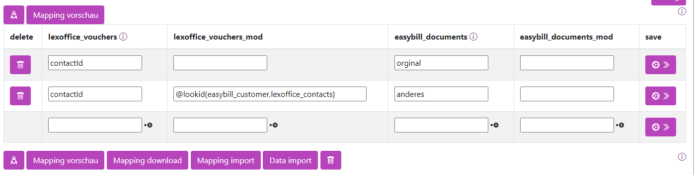

# Lookup ID
*Stand: Turm mindestens Version 15.4.0 - 17.07.2024*

## Mapping: Nachschlagen nach IDs 

Es kann vorkommen, dass man eine ID aus einem externen System benötigt.

Ein typisches Beispiel hierfür ist die Nutzung von unterschiedlichen Anwendungen für Rechnungsstellung und Buchhaltung.

Beispielsweise Easybill als Rechnungsapplikation und Lexoffice für die Buchhaltung, die beide Adressdaten aus einem gemeinsamen CRM-System, wie espoCRM, beziehen. Wenn nun Daten, speziell Rechnungen, von Easybill zu lexoffice transferiert werden müssen, tritt ein Problem auf:

In Easybill wird für jeden Account lediglich die interne ID verwendet.
An dieser Stelle wird @lookid nützlich. Diese Funktion ermöglicht es, die ID aus Easybill in die entsprechende ID in Lexoffice zu konvertieren, um eine reibungslose Übertragung und Integration der Daten zu gewährleisten.

@lookid(app1_company,app2_firmen,name)
```
 @lookid(tabellenname, referenztabelle,optionale Spalte)
```

 

| Name            | Bedeutung                                                                                                                                                                                  | Beispiel              |
| --------------- | ------------------------------------------------------------------------------------------------------------------------------------------------------------------------------------------ | --------------------- |
| tabellenname    | Der Name der Ziel Entität. Der Name der Tabelle die die gewünschte ID enthält.                                                                                                                 | `easybill_customer`   |
| referenztabelle | Der Name der Nachschlage Entität. Meist von gleichen Modul. Also z.B. von lexoffice_vouchers -> lexoffice_customers. Wird nichts angegeben wird die eigene Tabelle als referenz verwendet. | `lexoffice_customers` |
| optionale Spalte| In der Zieltabelle kann eine beliebige Spalte ausgegeben werden also nicht nur die ID. 

### Beispiel

nehmen wir an wir haben drei Apps.

- app1
- app2
- app3

Alle drei Apps haben Kontakte (Adressen).
Die Kontakt Tabellen der Apps lauten: 

- app1: adresses
- app2: contact 
- app3: Contact
  
Die Kontakte der app1 sind mit app3 synchronisiert (Ein Mapping ist im angelegt)
Die Kontakte der app2 ist ebenfalls mit den Kontakten der app3 sychonisiert.

Die Kontakte der App1 haben aber keinen direkten Bezug zu den Kontakten der App2. 
Lediglich über die indirekte verbindung der App3.

Analog zu Kontakten sind auch Firmen Tabellen vorhanden. 
Auch hier ist nur eine indirekte verbindung über die App3 vorhanden.
-------------------------------------

#### ID von indirkter Beziehung
Der Turm ist nun so schlau diese indirekte Beziehung zu nutzen,
so kann in der app2 ganz einfach die ID der app1 ausgegeben werden. 

```
@lookid(app1_adresses)
```


#### Fremd ID
Es kann auch eine andere Spalte als die der ID genutzt werden.
Soll zum Beispiel bei den Kontakten nun die entsprechende Firmen ID ausgegeben werden, kann der Befehl erweiterter werden.

in unserem Beisiel existiert in der Tabelle app2_contact eine Spalte companieid. 
Diese referenziert  auf app2_firmen. Diese Verbindung wird von der App2 intern gepflegt. Der Turm ruft diese Daten nur ab.

Nun nutzen wie im ersten Beispiel die indirekte Beziehung der Firmen, aber aus den Kontakten heraus.


```
@lookid(app1_company,app2_firmen)
```

1. app2_company: Der Name der ZielTabelle  im end Ergebnis wird also die ID der Firma aus der App1 ausgegeben
2. app2_firmen: Die Spalte *companieid* in der ursprungstabelle app2_contact ist die ID aus app2_firmen. Wir qualifizieren damit die Spalte comanieid als Mapping Spalte. 


Achten Sie darauf, dass in der ersten Spalte nun nicht mehr *id_ext* sondern *companieid* steht.

#### Fremd ID mit anderem Feld

Soll zu dem beschriebenen Szenario nun eine andere Spalte ausgegegebn werden, wird der Spaltenname als letzten Parameter übergeben. 

