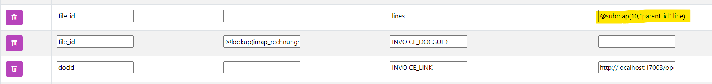

# Submap / JSON
*Stand: Turm Version 14.22.1 - 01.02.2024*

## Submap: Ein ganzes Mapping als Unterkey verwenden

Manchmal ist es erforderlich, dass ein Schlüssel ein komplettes Mapping enthält. Dies ist typischerweise der Fall, wenn eine gesamte Abrechnung mit Positionen übergeben wird. Hierbei wird der Rechnungskopf als ein Mapping angegeben, und in einem zweiten Schritt die Positionen. Anschließend wird im Rechnungskopf die *Submap* referenziert.

 

Um eine Submap zu erstellen:
1. Erstellen Sie ein Mapping, das die Unterpositionen enthält.
2. Notieren Sie sich die Mappingnummer.
3. Fügen Sie in dem *übergeordneten* Mapping die Nummer mit dem Schlüsselwort `Submap` ein.

```
 @submap(<MappingNummer>,"<SpaltenNameInUnterMapping>", <KeyProZeile>)
```

| Wert    |       Bedeutung           | Beispiel     |
|--------|--------------------------|------------|
|`<MappingNummer>`|Die Nummer des Mappings, die in der Konfigurationsoberfläche eingesehen werden kann| 4|
|`<SpaltenNameInUnterMapping>`| Die Spalte im Mapping, die die ID zum übergeordneten Element enthält, z.B. bei Rechnungen die RechnungsID|`"parent_id"`|
|`<KeyProZeile>`| Vor allem beim XML-Export wichtig. Hier enthält eine Zeile einen Namen: ` <lines><line> <pos1>1</pos1><line/><lines/>`. Jede Zeile hat in diesem Beispiel den Namen *line* |`line`|

Ein Aufruf aus dem Mapping mit der Nummer 10, bei dem im Mapping eine Spalte mit dem Namen *parent_id* angegeben ist und im XML mit "line" getrennt ist, würde dann lauten:
```
@submap(10,"parent_id",line)
```

!!! tip "Submapping"
    Beim Submapping sollte in der Regel keine ID mehr vom *Parent* enthalten sein. Um dies zu erreichen, geben Sie einfach im Submapping ein `@no@` an, wie [hier](01_functions_var.md#felder-nicht-im-zielsystem-ubertragen) beschrieben.

---------------------


## Eine Tabelle als Unter-Key in JSON darstellen

Um ein Array oder JSON-Objekt aus einer Untertabelle an eine API zu übergeben, kann `@json` verwendet werden. Dabei wird in einer Untertabelle im Turm nachgeschaut und die Untertabelle in ein JSON-Format umgewandelt, beispielsweise um eine Rechnung mit Rechnungspositionen zu übergeben.

```
 @json(tabellenname, referenzwert, list, "nameSpalte1" AS keyname, "nameSpalte2" AS keyname2)
```

Die Referenz bezieht sich – momentan noch – ausschließlich auf eine definierte Tabelle oder View. Mappings können nicht angesprochen werden.

| Wert           | Bedeutung                                                                                                                                                     | Beispiel             |
|----------------|---------------------------------------------------------------------------------------------------------------------------------------------------------------|----------------------|
| tabellenname   | Der vollständige Name der Nachschlagetabelle ohne ".                                                                                                          | espocrm_positions    |
| referenzwert   | Der Key, der z.B. die Positionen mit der Rechnung verbindet. Er muss denselben Wert haben wie die Spalte, die in der ersten Spalte benannt wurde.             | invoice_id           |
| list           | Die JSON-Struktur kann entweder als Key-Value-Paar zurückgegeben werden (z.B. `{"nr":1, "name":"eine Position}`) oder als Liste von Key-Value-Paaren (z.B. `[{"nr":1, "name":"eine Position},{"nr":2, "name":"noch eine Position}]`). Wird nichts angegeben (einfach nichts schreiben), entscheidet das System selbständig über die Darstellung. Wird `list` angegeben, wird auch, wenn nur ein Wert zurückgegeben wird, eine Liste ausgegeben. Die Auswahl hängt vom Zielsystem ab, meistens ist jedoch `list` die gewünschte Methode. | list                |
| "nameSpalte1" AS keyname, "nameSpalte2" AS keyname2 | Die Felder, die im JSON ausgegeben werden sollen. Dabei wird der Spaltenname in der Tabelle genannt und in doppelten Anführungszeichen gesetzt, gefolgt vom Namen, der im JSON als Key verwendet werden soll nach dem `AS`. Mehrere Spalten werden mit `,` separiert. | "rownumber" AS nr    |

Wichtig: Der Befehl muss in der ersten Modifikationsspalte eingegeben werden.

### Format der Spalten in der Untertabelle angeben

Die Typen der Werte innerhalb der Untertabelle entsprechen den Werten in der Datenbank. Sollen die Werte in einem anderen Format ausgegeben werden, können diese gecastet werden.

Dabei folgt das System den offiziellen PostgreSQL-Casts, z.B.:
```
"rownumber"::bigint AS nr
```

gibt die Spalte als Integer wieder. Dabei wird der gewünschte Typ direkt hinter den Spaltennamen geschrieben und mit `::` vorangestellt:
```
"spaltenname"::type AS neuerName
```

Achtung: Schlägt die Umwandlung fehl, wird nichts ausgegeben.

Folgende Casts sind sinnvoll:

| Wert    | Bedeutung                             |
|---------|---------------------------------------|
| bigint  | Gibt den Wert als **Integer** wieder. |
| text    | Gibt den Wert als **String** wieder.  |
| numeric | Gibt den Wert als **Float** wieder.   |

Prinzipiell können alle Casts von PostgreSQL verwendet werden, empfohlen werden jedoch die oben genannten.

| espocrm_invoices | espocrm_invoices_mod                                                  | lexoffice_vouchers | lexoffice_vouchers_mod |
|------------------|-----------------------------------------------------------------------|---------------------|------------------------|
| id_ext           | @json(espocrm_positions, invoice_id, list, "rownumber" AS nr, "amount" AS net, "description" AS text) | positions            |                        |
