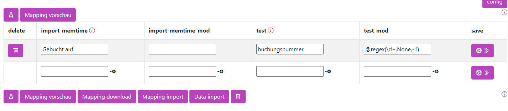

# Regex


## regex: Ein Teil des Strings mit Regex suchen und zurückgeben

Reguläre Ausdrücke, auch bekannt als Regex oder RegExp, sind eine mächtige Methode zur Textsuche und -manipulation, die es ermöglicht, komplexe Suchmuster zu definieren. 

Mit einer eigenen, speziellen Syntax können Nutzer spezifische Zeichenfolgen in Texten suchen, extrahieren oder ersetzen. Regex nutzt Metazeichen wie Punkt (.), Stern (*) und Fragezeichen (?) zur Bildung vielfältiger Muster, während Zeichensätze durch eckige Klammern [ ] und Gruppierungen durch runde Klammern ( ) definiert werden. Ihre universelle Unterstützung in vielen Programmier- und Skriptsprachen macht sie zu einem unverzichtbaren Werkzeug in der Verarbeitung und Analyse von Textdaten.

 


Um Regex anzuwenden wird ```@regex``` verwendet. 


```
 @regex(<pattern>,<ersatzwert>, <nr>)
```

| Wert    |       Bedeutung           | Beispiel     |
|--------|--------------------------|------------|
|`<pattern>`|Das Regex-Muster, das zur Suche genutzt wird | `\d+` |
|`<ersatzwert>`| WWas zurückgegeben werden soll, wenn das Muster nicht gefunden wird. None steht für leer. |`None`|
|`<nr>`| Die Position, an der das Muster genommen wird: 0 = erste Stelle, 1 = zweite Stelle, -1 = letzte Stelle, -2 = vorletzte Stelle. Wenn nichts angegeben wird, wird das erste Vorkommen genommen. |`-1`|

!!! tip "Für String"

    Regex wird nur auf *Strings* (Zeichenketten) angewandt, andere Datentypen wie *Integer* werden direkt zurückgegeben.


Um aus einem Text die zuletzt vorkommende Zahl zu extrahieren, wird folgendes angegeben:

```
@regex(\d+,None,-1)

```

!!! tip "Regex Online Tools"

    Es gibt Online-Tools, in denen man sein Muster testen kann, z.B. [https://regex101.com/](https://regex101.com/). Dort sollte man den Flavor auf Python einstellen.

---------------------


## Wichtigste Pattern 

| Metazeichen | Beschreibung                                                |
|-------------|-------------------------------------------------------------|
| `.`         | Entspricht jedem Zeichen außer einem Zeilenumbruch.         |
| `^`         | Entspricht dem Anfang einer Zeile.                          |
| `$`         | Entspricht dem Ende einer Zeile.                            |
| `*`         | Entspricht 0 oder mehr Wiederholungen des vorherigen Elements.|
| `+`         | Entspricht 1 oder mehr Wiederholungen des vorherigen Elements.|
| `?`         | Entspricht 0 oder 1 Wiederholung des vorherigen Elements.   |
| `{n}`       | Entspricht genau n Wiederholungen des vorherigen Elements.  |
| `{n,}`      | Entspricht n oder mehr Wiederholungen des vorherigen Elements.|
| `{n,m}`     | Entspricht zwischen n und m Wiederholungen des vorherigen Elements.|
| `[...]`     | Entspricht jedem der Zeichen in den Klammern.               |
| `[^...]`    | Entspricht jedem Zeichen, das nicht in den Klammern steht.  |
| `|`         | Entspricht entweder dem Ausdruck vor oder nach dem Operator.|
| `( )`       | Gruppiert Teile eines Musters zusammen und speichert sie.   |
| `\`         | Entwertet ein Metazeichen (macht es zu einem Literal).      |
| `\d`        | Entspricht jedem Ziffernzeichen (0-9).                      |
| `\D`        | Entspricht jedem Nicht-Ziffernzeichen.                      |
| `\w`        | Entspricht jedem Wortzeichen (Buchstaben, Ziffern, Unterstrich).|
| `\W`        | Entspricht jedem Nicht-Wortzeichen.                         |
| `\s`        | Entspricht jedem Leerzeichen (Leerzeichen, Tab, Zeilenumbruch).|
| `\S`        | Entspricht jedem Nicht-Leerzeichen.                         |
