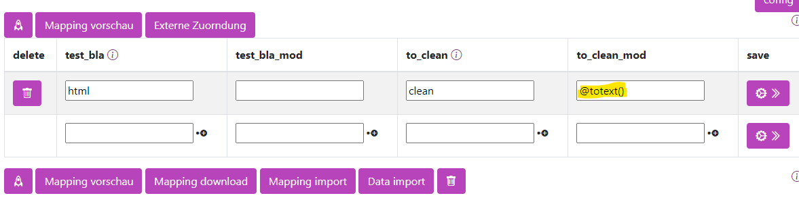

# Markup zu Text

## Einen HTML,XML, Markdown, oder RTF Text als reinen Text ausgeben

Wird ein HTML oder XML Text übergben, kann diese bereingigt werden, hierfür einfach totext angeben



Um Regex anzuwenden, wird `@totext` verwendet.

```
@totext(<typ>,<ersatzwert>,<feld>)
```

| Wert    |       Bedeutung           | Beispiel     |
|--------|--------------------------|------------|
|`<typ>`|Die Art des inputs also ob es HTML, XML,Markdown usw. ist. Standard: HTML | `markdown` |
|`<ersatzwert>`| WWas zurückgegeben werden soll, wenn das Muster nicht gefunden wird. None steht für leer. |`None`|
|`<nr>`| Was Konvertiert werden soll, wird nichts angegeben wird die Inputzeile genommen


### Mögliche Konvertierungen

- ```html``` Konvertiert html input in Text.
- ```xml```  Konvertiert xml input in Text.
- ```markdown``` Konvertiert Markdown input in html und anschließend in  Text.
- ``rtf`` Konvertiert Rich Text  input in Text.


## Beispiele


### HTML
```
@totext()
```
Ohne Angabe wird aus

```
<html>
    <p>hallo Mein Text</p>
</html>
``` 

`hallo Mein Text`


### Markdown
```
@totext(markdown)
```

wird aus 
``` markdown 
# Hallo
##  Mein Text 


```

```
Hallo
Mein Text
```

