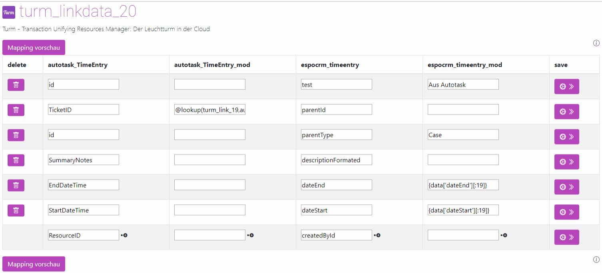

# Bearbeiten

## Mapping von Daten   - Einleitung
Die Zuweisungen der Werte - also das Mapping - erfolgen in den *Turmlinks*.   
Rufen Sie das Mapping auf, indem Sie auf das Zahnrad klicken. 

      

Sie sehen mindestens vier Spalten in der Mappingansicht:

1. Name der primären Tabelle 
2. Name der primären Tabelle _mod 
3. Name der sekundären Tabelle 
4. Name der sekundären Tabelle _mod 
  

## Ein einfaches Mapping

+ Wählen Sie in der ersten Spalte aus der Vorschlagsliste die Spalte aus, deren Daten Sie benötigen.    
+ Wählen Sie anschließend in der dritten Spalte das Ziel aus. 
+ Klicken Sie auf das Zahnrad am Ende der Spalte, um zu speichern. 

!!! tip "Automatischer Spalten import"
     Der Turm importiert automatisch beim Import aus Fremdsystemen die Spalten. Fehlt eine Spalte in der Vorschlagsliste, empfiehlt es sich, einen Import zu starten. Sie können aber auch einfach den Namen reinschreiben. Achten Sie darauf, dass der Name korrekt geschrieben ist. 

## Grundlegende Funktionalitäten

In der untersten Zeile können Sie neue Felder verknüpfen.

!!! tip "Zeilenweises speichern" 
     Es wird immer pro Zeile gespeichert. Vergessen Sie nicht, für jede Zeile einzeln auf den Speicherknopf zu drücken.       

In den oberen Zeilen können Sie die bestehenden Verknüpfungen ändern.      
Die Änderungen werden im nächsten Synchronisationsvorgang übernommen.     

Ein *Klick* auf den *Papierkorb* löscht die Spalte.    

Sie haben noch mehrere Buttons am Ende der Tabelle:

1. **Mapping-Vorschau:** Zeigt die ersten 1000 Datensätze des erstellten Mappings in Tabellenform an.   
   Dies sind die Daten, die das Fremdsystem vom Turm erhält.
2. **Mapping-Download:** Bietet die Möglichkeit, die Einstellungen herunterzuladen. Es handelt sich um einen Text, der in einem anderen Mapping wieder verwendet werden kann. Das andere Mapping kann auch auf einem anderen Turm eingespielt werden. 
3. **Mapping-Import:** Hier wird die unter **Mapping-Download** gespeicherte Konfiguration wieder eingespielt.    
   *Tipp:* Das bereits angelegte Mapping bleibt bestehen und wird durch den Import ergänzt. Soll ein neues Mapping angelegt werden, bitte zuvor die Konfiguration löschen. 
4. **Papierkorb:** Löscht die bestehende Mapping-Konfiguration unwiderruflich. Die Verbindung der Daten und die Daten selbst bleiben davon unberührt. 

!!! tip "Pro-Tipp"
    Durch den Download von Mappings kann ein Mapping auch bei mehreren Kunden eingesetzt werden.    
Der Vorgang wäre dann:
- Leere Tabellen mit den Zielnamen anlegen
- Neuen Mapping-Link zwischen den beiden anlegen
- Mapping importieren

## Bedeutung der Spalten 
Die *_mod*-Spalten beschreiben Modifikationen der Daten.  
Es können beliebige *Python*- und *SQL*-Befehle ausgeführt werden (siehe weiter unten).   

- In der ersten *_mod*-Spalte werden die SQL-Befehle geschrieben.    
!!! tip "Pro-Tipp"
    Achten Sie darauf, dass der SQL-Server die Befehle noch versteht, z. B. Spaltennamen nicht doppelt auftreten oder nicht vorhanden sind.   

- Die zweite *_mod*-Spalte verändert die aus der Datenbank kommenden Werte. Dabei kommt Python-Syntax zum Einsatz.

Typischerweise nutzen Sie die Primary *_mod* für Lookups, z. B. Nachschlagen in einer weiteren Tabelle.   

Die Secondary *_mod* wird für das Ändern der Werte verwendet, z. B. für:
- Ändern des Datentyps 
- Ersetzen von Werten
- Ergänzen von Werten
- Fixe Werte übergeben

Die zweite *_mod*-Spalte wird deutlich öfter verwendet.    
Das Ändern von abgefragten Werten wird im Folgenden beschrieben. 

In der *_mod*-Spalte kann auf vielfältige Weise verändert werden. 

## Mögliche Mapping Funktionen
Im Folgenden werden die Möglichen Funktionen innerhalb eines Mappings aufgezeigt.

[Weiter: Funktionen ](Funktionen/00_functions.md){ .md-button }

## Daten mit Mapping in Fremdapp spielen

Das Mapping ist nur die Konfiguration um Daten in ein Fremdsystem zu überspielen, wird mit dem Mapping ein Workflow angelegt:

[Weiter: Workflows ](../2 Workflows/00_workflows.md){ .md-button }