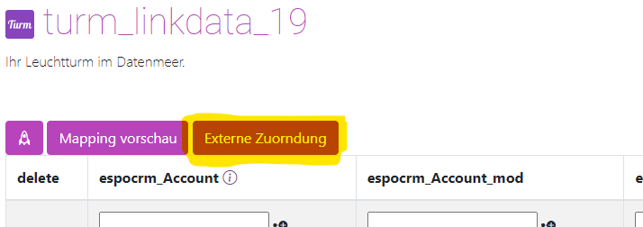
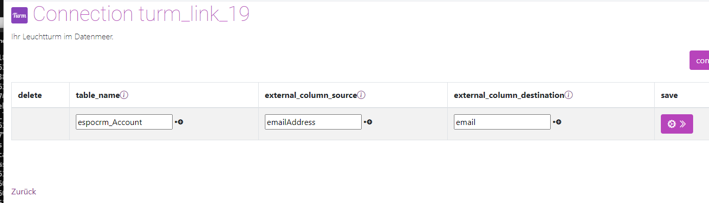

# Fremdid

## Einleitung 

Es kann gewünscht sein, dass eine andere Spalte als Identifier für eine Zuonderung gewünscht ist. 
z.B. Eine eindeutige Kundennnummer, Email Adresse oder Rechnungsnummer. 
Dies Marker sind nicht die ID aber sollen im Turm wenn in den Spalten vorhanden automatisch zugeorndet werden. 

Hierfür gibt es die Externe Zuorndung.

## Vorgehen 

Klicken Sie im Mapping bei dem Sie die zusätzlichen Kriterien hinterlegen wollen, auf *Externe Zuordnung* 

 

- wählen Sie  zunächst bei *table_name* die Tabelle aus der Sie die Zuordnung erstellen wollen. 
- Wählen Sie nun bei *external_column_source* die Spalte aus die als Basis für den Vergleich dienen soll
- Wählen Sie anschließend bei *external_column_destination* die Spalte aus mit der Vergleichen werden soll

Werden in den beiden Spalten die selben Werte gefunden, wird werden die Datensätze automatisch einander zugeondert, auch wenn die IDs unterschiedlich sind.  

Werden mehrere Zeilen in einem Mapping zugeondert, müssen alle Spalten identisch sein um eine Zuordnung zu erhalten. 
 
