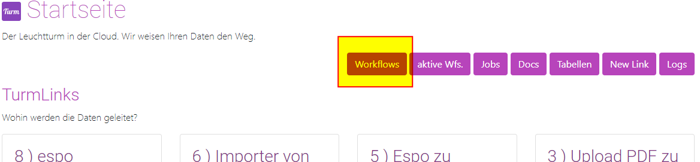
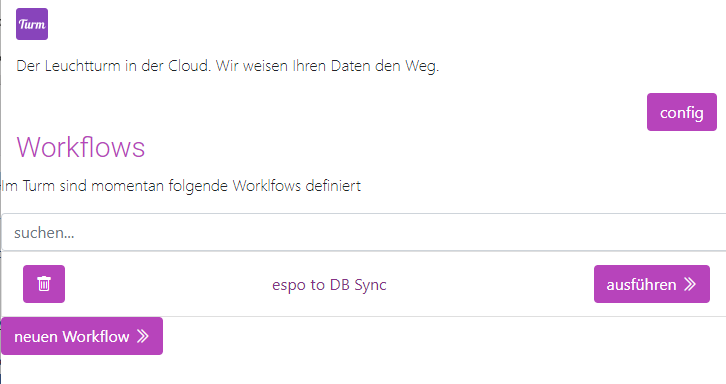

# Ansehen
Der Turm untscheidet zwischen Workflows und Workflow Jobs. 

Man man so will ein ein Workflow die definierte Vorlage und ein Workflow Job ein konkretes ausführen. 


## Workflow anzeigen 


Alle definierten Workflows findet man unter:
```
/workflows
```

```
http://localhost:8000/workflows/
```
   


Die Liste zweigt alle definierten Workflows an und bietet die Möglichkeit dies [Manuell](02_workflows_run.md) auszuführen. 

   


## Workflow Jobs ansehen

Workflows die momemtan auf dem Server aktiv sind, werden als *Workflow Jobs* bezeichnet. 

### Workflow Job Status ansehen

Alle aktiven Workflow Jobs werden aufgelistet unter:

```
/workflow/aktiv/jobs
```

```
http://localhost:8000/workflow/aktiv/jobs/
```
     

#### Ein Workflow Job Details 

     

Es wird der Name, Status, Start und Endzeit des Workflow Jobs angezeigt.
Zudem kann hier direkt ins Logfile gesprungen werden. 
   
Die Liste bleibt nur für die Dauer des Turmes erhalten, nach einem Neustart ist die Liste wieder leer. 
Die Liste gibt eine Übersicht über die aktiven Workflows. Bricht ein Job ab, wird dies hier angezeigt. Um herauszufinden an welchem Punkt der Job abgebrochen ist, oder momentan steht kann eine Detail Ansicht geöffnet werden.  

#### Ein Workflow Todos Status
Der Status der Todos innerhalb eines Workflows kann sich mit klick auf den Workflow angezeigt werden. 
    


- Todos mit Haken sind Abgeschlossen. 
- Todos mit einem Kreisel werden momentan aktiv bearbeitet
- Todos mit dem Pausenzeichen warten bis das vorherige Todo abgeschlossen sind.  
- Todos mit einem Warndreieck sind Fehlgeschlagen. 

!!! tip "Tipp " 
    in Workflow kann Eingestellt werden ob der gesamte Workflow stoppt sobald ein Fehler in einem Todo auftritt, oder nicht (siehe nächster Abschnitt)  


[Weiter: Workflow Ausführen ](02_workflows_run.md){ .md-button }
