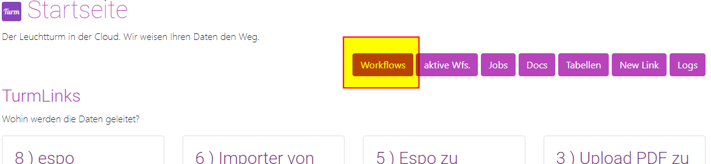
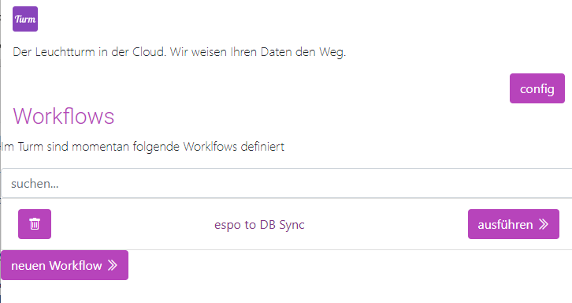

# Ausführung

## Einleitung

Workflows können auf unterschiedliche Arten initiiert werden:

- Manuell
- Zeitgesteuert
- Durch externe Trigger von anderen Systemen

Eine Übersicht aller definierten Workflows findet man unter:
```
/workflows
```
http://localhost:8000/workflows/
```


## Manuelle Ausführung

Die Workflow-Liste zeigt alle definierten Workflows und bietet die Möglichkeit, sie manuell zu starten.



Ein Klick auf *Ausführen* startet den entsprechenden Workflow. Ein laufender Workflow wird als Workflow-Job bezeichnet.

!!! tip "Tipp"
    Standardmäßig kann jeder Workflow nur einmal gleichzeitig aktiv sein. Wenn der Workflow bereits läuft, wird kein neuer gestartet.

Ein Workflow kann auf folgende Weisen ausgeführt werden:

- Manuell, wie oben beschrieben, durch einen Klick auf *Ausführen*.
- Durch einen POST-Request an den Execute-Endpoint (hier trägt der Workflow den Namen *Name*). Der Endpoint erfordert eine Authentifizierung:
  ```
  /workflow/execute/NAME
  ```
  http://localhost:8000/workflow/execute/NAME
  ```
- Zeitgesteuert, indem der POST-Request in einen Job eingebunden wird (siehe weiter unten bei "Jobs").
- Über einen Webhook-Trigger, der ohne Authentifizierung ausgelöst werden kann (siehe weiter unten bei "Webhooks").

## Workflow automatisch ausführen

Es gibt zwei Hauptmethoden, um einen Workflow automatisch zu starten:

1. Durch einen Webhook, der den Workflow auslöst. Hierbei sendet ein externes System einen HTTP-POST-Request an:
   ```
   /webhook/{workflow_name}
   ```
   Für die Nutzung muss im Workflow der Haken bei "Webhook" gesetzt sein (siehe Details weiter oben im Abschnitt "Workflow").

2. Zeitgesteuert über Jobs, weitere Informationen finden sich im Abschnitt [Jobs](../3 Jobs/00_jobs.md).

[Weiter: Workflows Anlegen](04_workflows_create.md){ .md-button }
