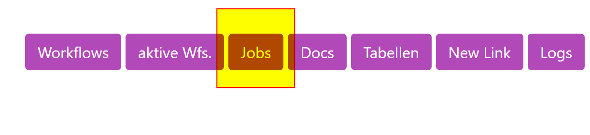
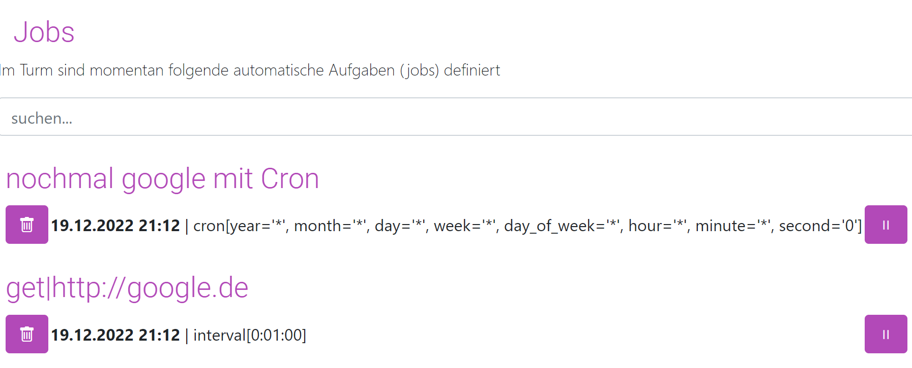

# Ansehen

## Einleitung 
Im Turm gibt es zwei Arten von Jobs:

1. Intervall
2. Cron

Intervall-Jobs werden in festgelegten Minutenabständen ausgeführt. Im Gegensatz dazu basieren Cron-Jobs auf der Cron-Syntax, die eine präzisere Steuerung darüber erlaubt, wann ein Job ausgeführt wird.

Weitere Informationen zur Cron-Syntax finden Sie unter:
- [Crontab Guru](https://crontab.guru/)
- [NetIQ Dokumentation](https://www.netiq.com/documentation/cloud-manager-2-5/ncm-reference/data/bexyssf.html)

## Jobs verwalten: Ansehen, Löschen, Pausieren
Definierte Jobs werden in der Job-Übersicht aufgelistet.

  
Die Übersicht zeigt den Namen, die nächste Ausführung und die Definition des Jobs. Im Bild sind zwei Jobs dargestellt:     
- Ein Cron-Job, der jede Minute ausgeführt wird.
- Ein Intervall-Job, der ebenfalls jede Minute ausgeführt wird.



Mithilfe des Papierkorbsymbols können Jobs dauerhaft gelöscht werden. Das Pausen-/Startsymbol ermöglicht das Pausieren und Fortsetzen von Jobs.

!!! tip "Pro-Tipp"
     Wenn in der URL ````show_all=True```` hinzugefügt wird, wird der gesamte Befehl (URL, Parameter, Header) angezeigt. Aus Sicherheitsgründen wird der Authentifizierungsheader nicht angezeigt, selbst wenn er gesetzt ist.

 [Weiter: Jobs anlegen](01_jobs_create.md){ .md-button }