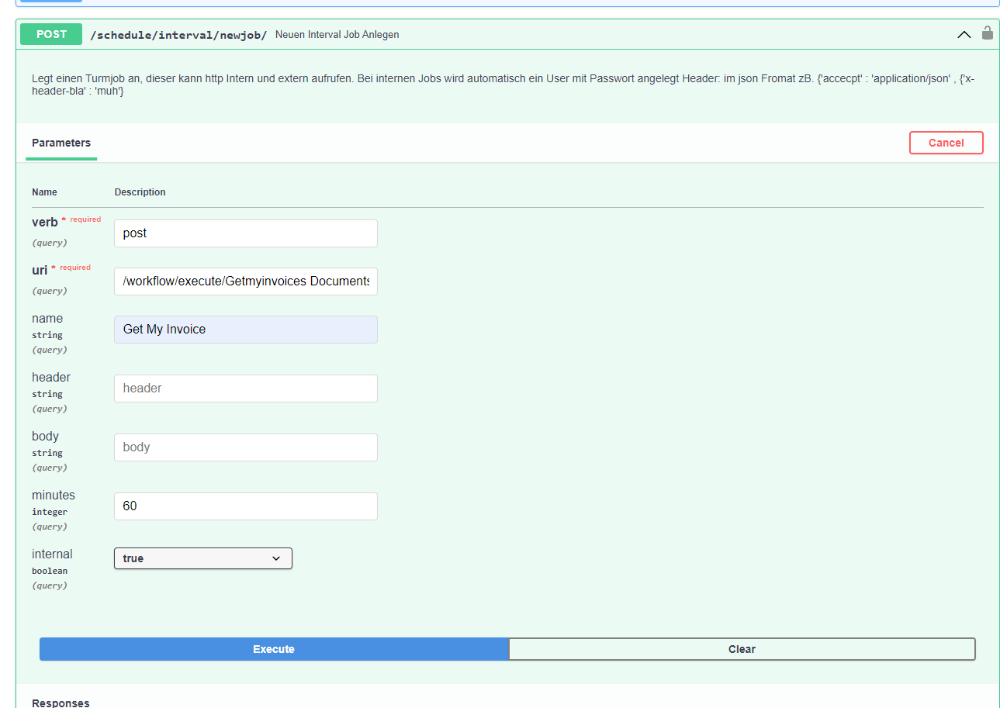

# Anlegen

Ein Job ruft stets einen HTTP-Endpoint auf, üblicherweise einen Workflow.

Zurzeit wird der Job noch über die Dokumentation angelegt.

## Einstellungen

| Feld     | Beschreibung |
|----------|--------------|
| type     | Gibt das HTTP-Verb an, für den Turm meist **POST**. |
| url      | Die aufzurufende URL. Für interne Turm-Aufrufe ohne den Pfad zum Server angeben. Aus `http://localhost:8000/espocrm/Accounts/sync/1` wird `/espocrm/Accounts/sync/1`. |
| name     | Der Name des Jobs für eine leichtere Zuordnung. Wird nichts angegeben, wird automatisch ein generischer Name erstellt. |
| header   | Der Header für den Job, z.B. `{'accept': 'application/json', 'x-custom-header': 'value'}`. Authentifizierungsheader für interne Aufrufe müssen nicht angegeben werden, sie werden automatisch erzeugt, wenn der Haken bei Intern gesetzt ist. |
| internal | Gibt an, ob ein interner Job aufgerufen werden soll (meistens True). |
| body     | Der Body des HTTP-Aufrufs, meistens leer. |

!!! tip "Tipps"
     Bei internen Jobs ohne `accept` im Header wird dieser automatisch hinzugefügt.

## Intervall-Jobs

```
docs#/TurmJobs/Neuen_interval_Job_anlegen_schedule_interval_newjob__post
```

```
http://localhost:8000/docs#/TurmJobs Neuen_interval_Job_anlegen_schedule_interval_newjob__post
```
 Der Job wird in Minuten angegeben
## Cron Jobs 
```
docs#/TurmJobs/Neuen_interval_Job_anlegen_schedule_cron_newjob__post
```

```
http://localhost:8000/docs#/TurmJobs/Neuen_Corn_Job_anlegen_schedule_cron_newjob__post
```


## Einen Workflow zeitgesteuert ausführen    
 





## Einen Workflow zeitgesteuert ausführen


| Feld    | Beschreibung | Beispiel |
|---------|--------------|----------|
| type    | Immer **POST** | `POST`|
| url     | Setzt sich zusammen aus `/workflow/execute/` und dem Namen des Workflows. | `/workflow/execute/Getmyinvoices Documents nach Ecodms  Ecodms` |
| name    | Der Name des Jobs für eine leichtere Zuordnung. Ohne Angabe wird ein generischer Name erstellt. | `Getmyinvoices Documents nach Ecodms  Ecodms` |
| header  | Immer leer lassen. | |
| internal| Immer `true`. | `true` |
| body    | Immer leer lassen. | |
| minutes | Die Häufigkeit der Jobausführung in Minuten. | `60` |


