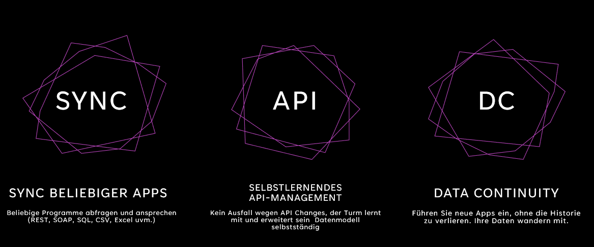
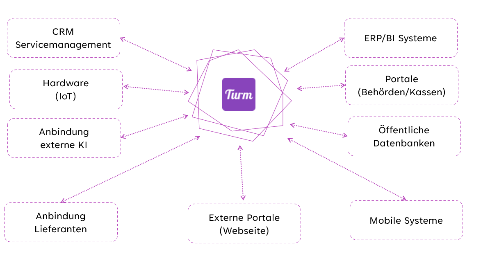
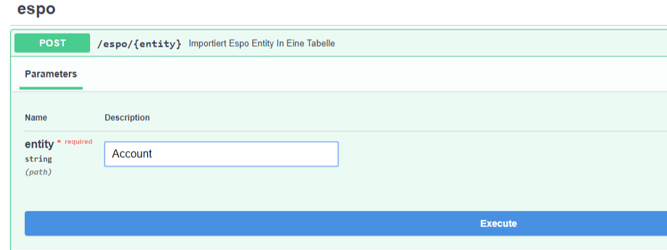

# Turm Konzept 

Der Turm ermöglicht die Vernetzung verschiedener Programme miteinander. Er lernt autonom dazu, wenn Änderungen in Programmen auftreten und verwaltet alle Zustände der Apps, einschließlich historischer Daten, um diese in neue Apps zu integrieren.

Der Turm setzt sich aus zahlreichen Modulen zusammen, die für spezialisierte Aufgaben zuständig sind. Dazu gehören:

- Module zur Aufbereitung von PDFs
- Module zur Interaktion mit Dokumentenmanagementsystemen
- Module zur Steuerung von CRM-Systemen
- Module für Buchungen in ERP-Systemen
- Module zum Veröffentlichen lokaler Daten

## Schematischer Ablauf

Der Turm extrahiert Daten aus einem System, ergänzt, filtert und bearbeitet diese in Echtzeit und überführt sie in eine andere App. Dabei erkennt turm.ai automatisch fehlende oder neu hinzugekommene Felder und ermöglicht auch die Änderung älterer Daten.

## Beispielmodul: EspoCRM

Das Modul `espocrm` steuert die Kundenverwaltungs-Web-App. Beispielsweise können alle Accounts aus dem EspoCRM importiert werden, indem in der Dokumentation nach `espocrm` gesucht wird.

### Datenimport aus EspoCRM

Für den Datenimport aus EspoCRM in den Turm muss lediglich der Endpoint, hier `Account`, von EspoCRM angegeben werden.

Anschließend startet der Turm automatisch den Importprozess, der folgende Schritte umfasst:

1. Erstellung einer Tabelle im Turm, falls diese noch nicht existiert. Der Tabellenname folgt dem Muster `modulname_Entität`, also im vorliegenden Fall `espocrm_Account`.
2. Automatische Ergänzung fehlender Spalten in der Tabelle. Neue Felder, die von der API bereitgestellt werden, werden integriert und sind sofort nutzbar.
3. Import und Abgleich der Daten. Existierende Datensätze mit identischer ID werden aktualisiert, anstatt doppelt angelegt zu werden.
4. Speicherung des Erstellungs- und Änderungsdatums jedes Datensatzes.
5. Optionale Weitergabe der ID an verknüpfte Links, um Änderungen oder das Hinzufügen neuer Datensätze anzuzeigen.

### Daten Weitergabe 

Nach dem Import können die Daten vollständig oder Teilweise an andere Systeme weitergeben werden. 
Dabei wird anhand eines sogenannten Mappings die Daten aufbreitet, hier können auch Daten aus anderen Systemen mit einfliesen, wie z.B. die Kundennummer in der Fibu. 

## Typischer Ablauf im Turm (Workflow)

Ein typischer Workflow im Turm könnte folgendermaßen aussehen:

1. Neue oder geänderte Dokumente aus dem CRM abrufen.
2. Diese Dokumente im DMS einpflegen oder nur die Metadaten bei bereits hochgeladenen Dokumenten aktualisieren.
3. Die IDs zurück ins CRM schreiben.

Dieser Workflow beteiligt zwei Module: das CRM-Modul (hier EspoCRM) und das DMS-Modul (hier EcoDMS). Der Turm unterstützt eine Vielzahl von Modulen und ermöglicht die Entwicklung und Integration eigener Module.

Der beschriebene Workflow veranschaulicht das ELT-Prinzip (Extrahieren, Laden, Transformieren): Daten werden aus einem System extrahiert, aufbereitet und in ein anderes System übertragen. Die Stärke des Turms liegt in der Vernetzung der Module, wodurch Entitäten systemübergreifend verknüpft werden können. Diese Verknüpfungen, auch Links genannt, werden später noch ausführlicher beschrieben.

[Weiter: Verwendung ](usage.md){ .md-button }