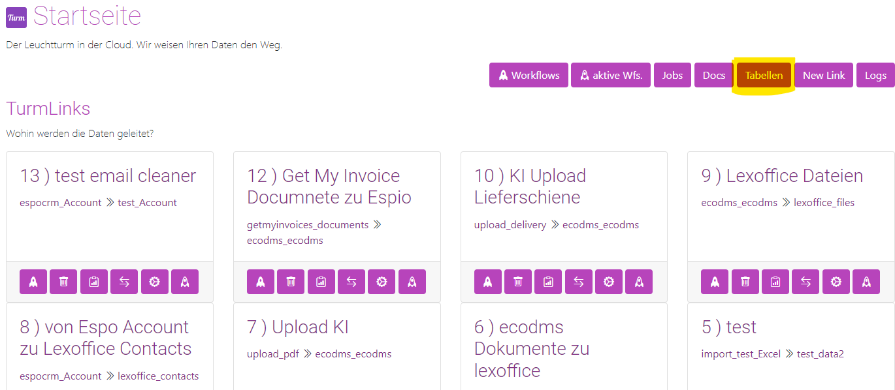
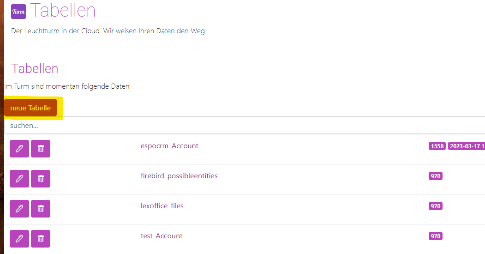

# Verwendung

## Modul- und Funktionsdokumentation
Jedes im System installierte Modul verfügt automatisch über eine Dokumentation. Die Dokumentation aller Modulfunktionen ist in Swagger eingebunden und unter folgendem Pfad zugänglich:

```
/docs
```

Beispiel:

```
http://localhost:8000/docs
```

## Module
Jedes Modul im Turm bietet mindestens zwei Funktionen:

1. **Datenabruf aus dem Quellsystem:** Beim Espo-Beispiel werden Daten von Espo in den Turm importiert. Der Endpunkt ist nach der jeweiligen Entität im Fremdsystem benannt. Um zum Beispiel `Accounts` abzurufen, lautet die POST-URL:

   ```
   espocrm/Accounts
   ```
   
   ```
   http://localhost:8000/espocrm/Accounts
   ```

2. **Datensynchronisation zum Fremdsystem:** Für die Übertragung von Daten vom Turm nach Espo wird der *Sync*-Endpunkt verwendet. Hier wird zusätzlich spezifiziert, welches Mapping genutzt wird. Bei Verwendung von Mapping Nr. 1 lautet der Endpunkt:

   ```
   espocrm/Accounts/sync/1
   ```

   ```
   http://localhost:8000/espocrm/Accounts/sync/1
   ```

!!!tip "Merke"
    - Alle Funktionen sind unter `/docs` zu finden.
    - Funktion: *Entity* > Import in den Turm.
    - Funktion: *Entity/sync/nr* > Export aus dem Turm in das Fremdsystem.

## Tabellen im Turm
!!!tip "Hinweis"
    Es ist **nicht** nötig, Tabellen manuell zu definieren. Der Turm legt automatisch Tabellen an, sobald   diese benötigt werden.

Der Name der Tabelle lautet immer *modulname*```_```*entity*. Für die EspoCRM Accounts wäre das:

```
espocrm_Accounts
```

!!!tip "Protipp"
    Der Turm differenziert zwischen internen und externen Tabellen. Interne Tabellen beginnen mit   ```turm_``` und sollten nicht extern verändert werden. Zum Beispiel enthält die Tabelle   ```turm_link_1``` die Verknüpfungen vom Link 1.

### Spalten im Turm

Jede Tabelle verfügt mindestens über vier Spalten, die automatisch vom Turm angelegt werden:

1. *id* – die turm-interne ID, automatisch hochgezählt durch den Turm.
2. *id_ext* – die ID aus dem externen System, muss eindeutig sein und dient der Aktualisierung von Datensätzen.
3. *turm_create_date* – das Erstellungsdatum des Datensatzes, wird automatisch durch den Turm gesetzt.
4. *turm_mod_date* – das Änderungsdatum des Datensatzes, wird automatisch durch den Turm aktualisiert.

Der Turm ergänzt fehlende Spalten selbstständig im laufenden Betrieb, ein manuelles Anlegen ist nicht erforderlich.

!!!note "Protipp"
    - Es können etwa 1.600 Spalten pro Tabelle angelegt werden.
    - Alle Spalten sind standardmäßig vom Typ Text und können bis zu 1GB Text aufnehmen (Stand: 13.09.2022)     ([PostgreSQL-Dokumentation](https://www.postgresql.org/docs/current/limits.html)).

!!!note "Protipp"
    Da jede Spalte standardmäßig vom Typ Text ist, kann es erforderlich sein, das Format anzupassen. Dies   geschieht im Mapping-Prozess (siehe weiter unten).

### Eine leere Tabelle anlegen

Es ist möglich, leere Tabellen anzulegen, falls noch kein Sync stattgefunden hat. Es ist jedoch empfehlenswert, eine Tabelle aus einem bestehenden System zu erstellen, da so auch gleich die Spalten des Fremdsystems automatisch angelegt und gemappt werden können.

Um eine Tabelle anzulegen, nutzen Sie die Tabellenübersicht:



Dort finden Sie einen Button zum Anlegen einer neuen Tabelle:



!!!tip "Merke"
    - Tabellen werden automatisch angelegt und benannt nach dem Schema: Modulname_Entityname.
    - Spalten werden automatisch angelegt und sind standardmäßig vom Typ Text, auch wenn sie eigentlich     Integer oder Datumsfelder darstellen.
    - Leere Tabellen sollten nur in Ausnahmefällen definiert werden.

!!!note "Protipp"
    Sie können auch Views in der Datenbank anlegen. Diese müssen allerdings im Namen mit ```_view``` enden.

## Mapping / Einen Link anlegen

Ein Link verbindet den Turm mit einem Fremdsystem. Hierbei werden Daten geändert oder übertragen. Dies erfolgt mittels Mapping. Das Mapping weist den Turm an, welche Informationen wohin geschrieben werden. Zum Beispiel soll das Feld *Notiz* aus dem CRM als *Beschreibung* im DMS erscheinen. Dadurch können Daten von einer Webapp zur anderen übertragen werden.

Jede Entität aus jedem Modul entspricht einer Tabelle im Turm. Um Entitäten zu verknüpfen, muss ein neuer *Link* angelegt werden.


[Weiter: Mapping anlegen ](1 Mapping/createmapping.md){ .md-button }
