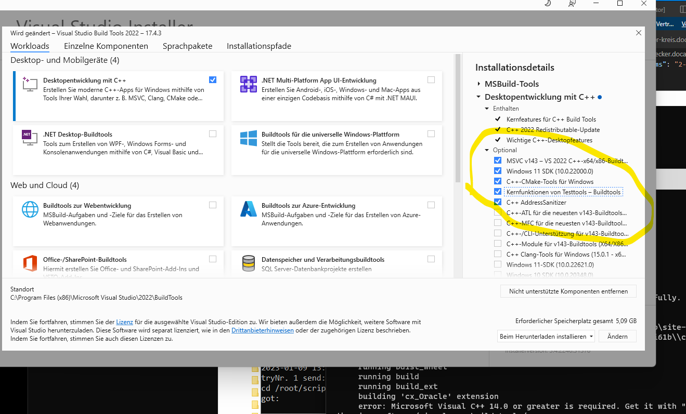

# Turm Installationsanleitung

Die Installation des Turms unterscheidet sich je nach Betriebssystem. Zunächst wird die Konfigurationsdatei erklärt, gefolgt von einer schrittweisen Anleitung für die jeweiligen Betriebssysteme.

!!! info "Nur On Premise"
    In der Cloud ist dieser Abschnitt nicht nötig

!!! warning "Basis Konfig"
    Achten Sie darauf erst die Basiskonfiguration zu haben:
    [Basiskonfig](base_configuration.md)
## Installieren


### Für Linux

1. Die Sourcecode-Zip herunterladen und unter `/opt/turm/` entpacken.
2. Folgendes ausführen:

    ```bash
    cd /opt/turm/install_turm/ubuntu/  && bash install.sh
    sudo -u postgres bash -c 'cd /opt/turm && source turmenv/bin/activate && python /opt/turm/turm.py "install-db"'
    ```

3. Um den Turm als Dienst zu betreiben, noch folgendes ausführen:

    ```bash
    cd /opt/turm/install_turm/ubuntu && bash register_deamon.sh
    ```

4. Der Turm ist betriebsbereit und kann unter folgender Adresse eingestellt werden:

    ```
    http://<TURM_URL>/config
    ```

### Für Windows

1. Die Sourcecode-Zip herunterladen und unter `C:\turm` entpacken.
2. Download von PostgreSQL 15 oder höher unter: [https://www.enterprisedb.com/downloads/postgres-postgresql-downloads](https://www.enterprisedb.com/downloads/postgres-postgresql-downloads)
3. PostgreSQL installieren (Stackbuilder wird nicht benötigt). Passwort für postgres vergeben und notieren.
4. Python mit Modulen installieren. Ausführen von:
    
    ```
    "C:\turm\install_turm\install.bat"
    ```
    
5. Auf CMD:

    ```
    C:\turm 
    CALL  turmenv\Scripts\activate.bat
    python turm.py "install-db"
    ```

6. Visual Studio Building Tools erweitern:

    

7. Soll der Turm als Dienst immer laufen, muss dieser noch registriert werden. Dafür folgendes Skript mit Adminrechten ausführen:

    ```
    "C:\Turm\install_turm\register_service.bat"
    ```

8. Turm starten:

    ```
    "C:\turm\RunTurm.bat"
    ```

9. Der Turm ist betriebsbereit und kann unter folgender Adresse eingestellt werden:

    ```
    http://<TURM_URL>/config
    ```


----------------------------------------

Anschließend die Benutzer konfigurieren:
[Benutzerverwaltung](benutzerverwaltung.md)

Happy *turming* :)
