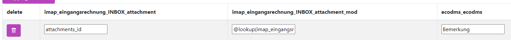

# Email Anhang Betreff

Wenn Sie im Mapping auf Email Daten wie z.B. Betreff  aus dem Anhängen brauchen können Sie darauf referenzieren
## Quick 
1 Spalte: ```attachments_id``` 2. Spalte: ```@lookup(imap_rechnungseingang_INBOX,attachments_id,subject)```

Möglichge Werte:

- ```subject```
- ```from```
- ```to```
- ```cc```
- ```bcc```
- ```date``` (Sendedatum in der E-Mail, nicht das Turm empfangs datum)
- ```text``` (wenn mit Importiert)
- ```html``` (wenn mit Importiert)

## Einleitung 
Sollen Zusatzinformationen von der E-Mail in ecoDMS angezeigt werden, kann dies konfiguriert werden. 

Wichtig: Der Tabellenname ist abhängig vom Postfachname und muss im Code bezüglich angepasst werden.


## Datenstruktur


Der Turm führt beim E-Mail import mehre Tabellen, die den Namen des Postfaches Tragen:

dabei folgend alle Tabellen diesem Schema:

```Imap_POSTFACHNAME_ORDNERNAME```

also für Eingangsrechnung und nachsehen in der Inbox

```Imap_eingangsrechnung_INBOX```

hier werden alle E-Mails abgelegt. 

Unter  ```Imap_POSTFACHNAME_ORDNERNAME_attachment``` also  ```Imap_eingangsrechnung_INBOX_attachment``` werden die Anhänge abgelegt.

## Mapping / Join / Lookup
Um nun auf z.B. den Sender von den Anhängen zurückzugreifen muss dieser die "E-Mail" Tabelle abgefragt werden.


Dies geschieht über die Funktion lookup. 


Dafür schreibt man unverändert in die erste Spalte:

```attachments_id```


In der Zweiten Spalte geschieht nun das nachschlagen in der E-Mail Tabelle. 

Soll z.B. der Betreff mit angegeben werden, die Spalte heißt in der Haupttabelle subject 

So muss in der zweiten Spalte (mit der Endung _mod)  angepasst auf den Postfachnamen (Postfachname Gelb, in diesem Fall eingangsrechnung) folgender Lookup geschieben werden:

```@lookup(imap_eingangsrechnung_INBOX,attachments_id,subject)```

