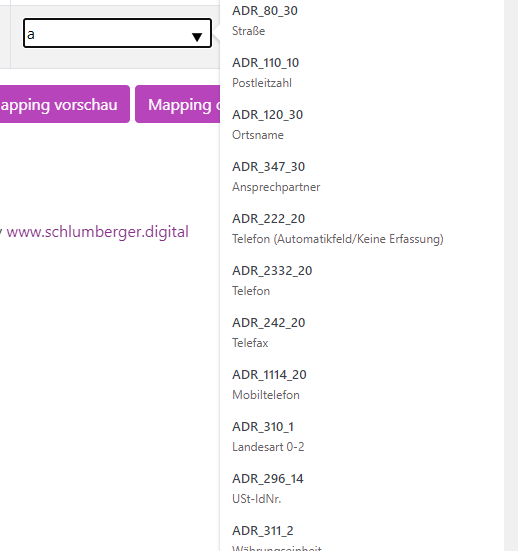
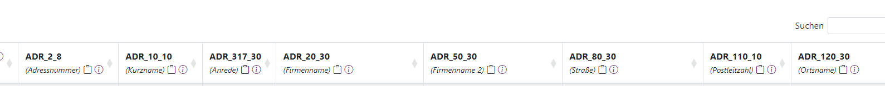

# Beschreibungen für Felder

Es können nun sprechende Namen für Datenbank Felder importiert werden.
Das ist v.a. bei alten Datenbanken praktisch die keine sprechende Feldnamen haben.
Also wo in der Datenbank nur *ADR_80_30* steht statt *Straße*.

Die importieren Begriffe tauchen dann sowohl im Mapping



, als auch in der Tabelle auf.



## Import von Übersetzungen

Der Import wird mit einer Excel Datei durchgeführt. 


### Tabelle vorbereiten 

Die Tabelle muss aus 3 Spalten bestehen.  
table	source	translation

Die Spalte *table* gibt den Namen der Tabelle im Turm an. 
Die Spalte *source* gibt den ursprünglichen Original Titel der Spalte an
Die Spalte *translation* wird dann in der Oberfäche angezeigt. 

| table                     | source  | translation  |
| ------------------------- | ------- | ------------ |
| oftengingewebware_ADRESSE | ADR_80_30 | Straße |


### Schiff upload Vorbereiten 

Der Upload Link lautet:

```
/uploaddata/turm_table_translation
```
also  z.B.
https://turm.meinserver.arkivado.digital/uploaddata/turm_table_translation
