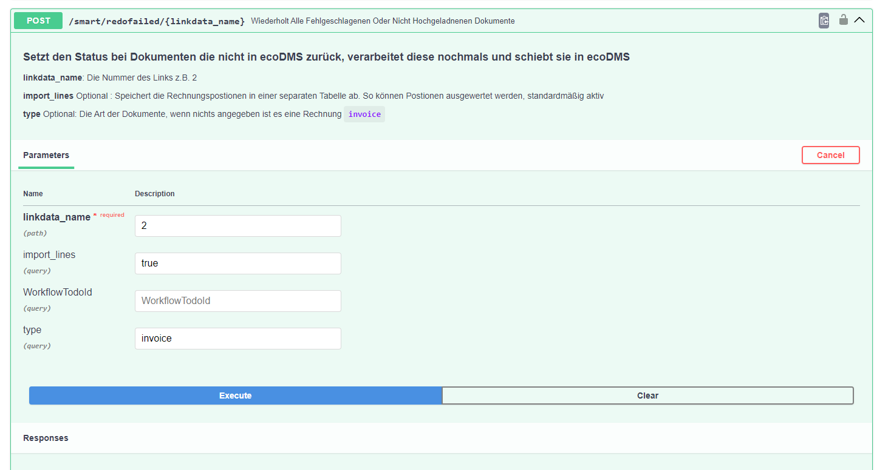

# KI Nachholen 


## Einleitung 
Es ist möglich fehlgeschlagene Dokumente nochmals nacholen.
Das ist nötig wenn z.B. ecoDMS offline war. 

## Vorgehen

Unter dem Enpdunkt in der

```POST /smart/redofailed/{linkdata_name}``` 


werden Dokumente die noch nicht in ecoDMS liegen nochmals durch die KI geschoben, klassifiziert und abgelegt.


|Feld     |	Beschreibung                        	| Beispiel |
|----------|------------------------------------| -------------|
|linkdata_name|der Mapping link der genutzt werden soll |```2```|
|import_lines |	```true```  (Postionen werden in eine extra Tabelle geschrieben) | ```true```|
|type| Die Dokumentenart z.B. invoce delivery usw. | ```invoice``` |